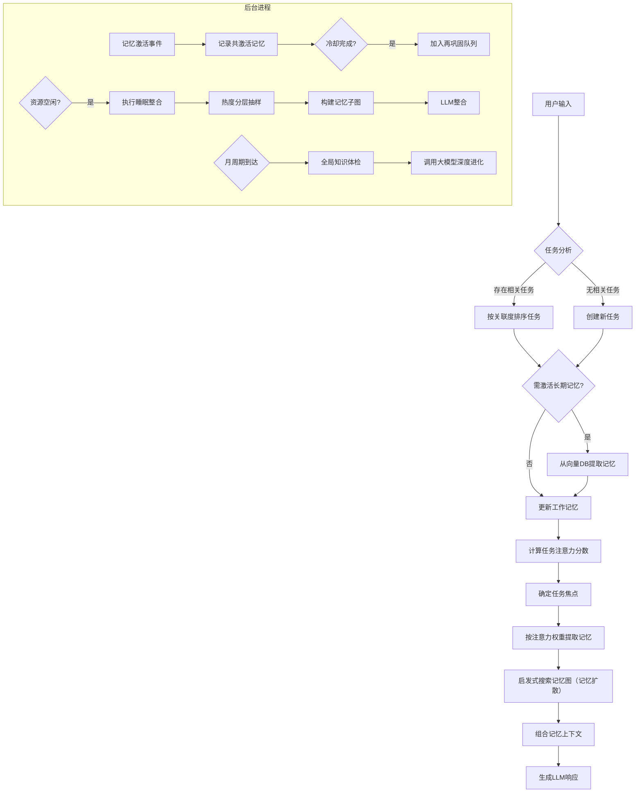
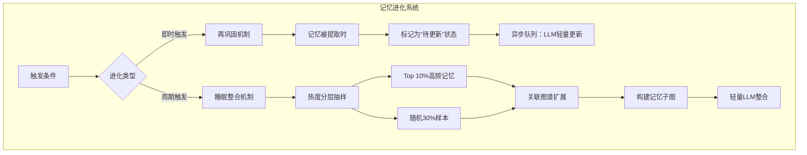

# Soulmem - 面向LLM的类人化记忆系统

为大型语言模型设计的记忆架构，通过模拟人类记忆机制实现更自然、连贯的响应和行为， 目前仍处于开发阶段。

## 核心概念

### 记忆层级
| 类型         | 存储位置   | 特性                     | 生命周期 |
| ------------ | ---------- | ------------------------ | -------- |
| **长期记忆** | 向量数据库 | 持久化存储，知识图谱结构 | 永久     |
| **工作记忆** | 内存       | 当前激活的记忆子图       | 暂时     |
| **临时记忆** | 工作记忆中 | 实时对话产生的临时信息   | 暂时     |

### 核心机制
- **任务 (Task)** 
  表示LLM当前处理的事件单元，包含关联记忆和注意力权重
- **任务焦点 (Focus)** 
  注意力分数最高的当前核心任务
- **激活 (Activation)** 
  长期记忆 → 工作记忆的提取过程，以及工作记忆 → LLM上下文的过程
- **巩固 (Consolidation)** 
  工作记忆 → 长期记忆的转化过程
- **再巩固 (Reconsolidation)**

  工作记忆被激活时，更新内容，建立联系的过程
- **睡眠整合 (Integration)**

  根据高频激活记忆和抽取的随机样本，更新记忆图的过程
- **进化 (Evolution)** 
  长期记忆的全局自优化过程（周期性执行）

## 记忆单元 MemoryNote

具有如下属性：

- content
  - 记忆原始文本内容
- id
  - uuid
- keywords
  - 关键词
- links
  - 联系记忆
- retrieval_count
  - 提取次数
- timestamp
  - 创建时间
- last_accessed
  - 上次访问时间
- context
  - 时空情景（时间，地点，交互对象等）
- evolution_history
  - 进化历史
- category
  - 记忆分类，surreal db 表名
- tags
  - 标签，包含（认知，行为...）
- base_emotion
  - 记忆的情感基调

#### 超单元 SuperNote （后续实现）

将一个由MemoryNote构成的子图，抽象为一个逻辑上的超节点，以降低图的复杂度。（后续更新优化）

## 工作流程

难点：

LLM对图结构数据的处理，尝试使用类似图摘要的算法

启发式搜索的策略设计，应设计多种策略适应不同的场合

根据注意力分数的抽样策略

## 实现进度

- [x] 记忆的基本组织结构体
- [x] 数据库接口封装
- [x] LLM调用（当前服务商仅SiliconFlow）
- [x] 临时记忆
- [x] 任务与任务焦点
- [ ] 记忆扩散机制（正在开发）
- [ ] 工作记忆（正在开发）
- [ ] 长期记忆
- [ ] 完整系统综合
