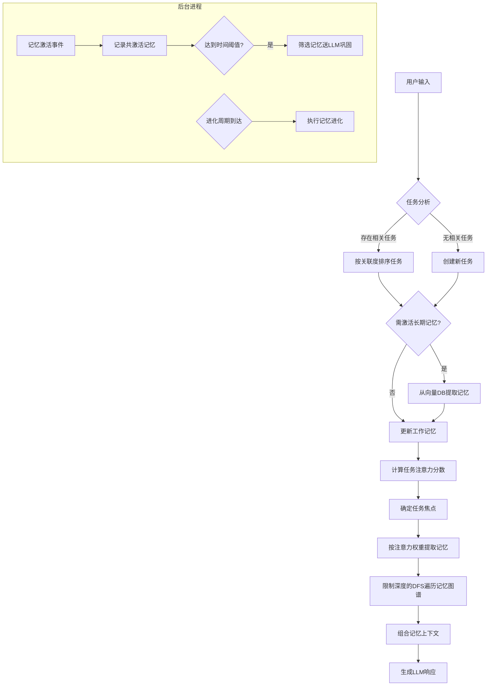

# Soulmem - 面向LLM的类人化记忆系统

为大型语言模型设计的记忆架构，通过模拟人类记忆机制实现更自然、连贯的响应和行为。

## 核心概念

### 记忆层级
| 类型         | 存储位置   | 特性                     | 生命周期 |
| ------------ | ---------- | ------------------------ | -------- |
| **长期记忆** | 向量数据库 | 持久化存储，知识图谱结构 | 永久     |
| **工作记忆** | 内存       | 当前激活的记忆子图       | 暂时     |
| **临时记忆** | 工作记忆中 | 实时对话产生的临时信息   | 暂时     |

### 核心机制
- **任务 (Task)** 
  表示LLM当前处理的事件单元，包含关联记忆和注意力权重
- **任务焦点 (Focus)** 
  注意力分数最高的当前核心任务
- **激活 (Activation)** 
  长期记忆 → 工作记忆的提取过程，以及工作记忆 → LLM上下文的过程
- **巩固 (Consolidation)** 
  工作记忆 → 长期记忆的转化过程
- **进化 (Evolution)** 
  长期记忆的自优化过程（周期性执行）

## 工作流程

