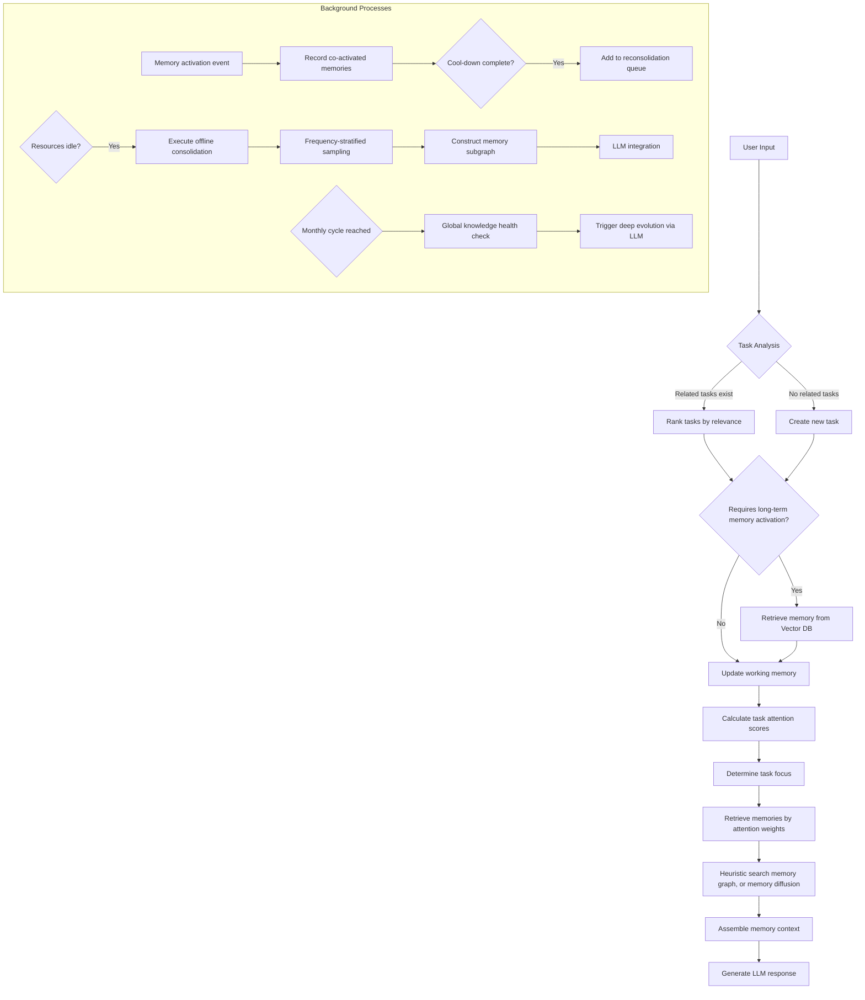

# Soulmem - A Human-like Memory System for LLMs

A memory architecture designed for large language models (LLMs) to achieve more natural and coherent responses and behaviors by simulating human memory mechanisms. This memory framework is still **under development**.

## Core Concepts

### Memory Hierarchy
| Type                 | Storage               | Characteristics                                   | Lifecycle |
| -------------------- | --------------------- | ------------------------------------------------- | --------- |
| **Long-term Memory** | Vector Database       | Persistent storage, knowledge graph structure     | Permanent |
| **Working Memory**   | RAM                   | Currently activated memory subgraph               | Temporary |
| **Temporary Memory** | Within Working Memory | Transient information from real-time conversation | Temporary |

### Core Mechanisms
- **Task** 
  Represents an event unit currently being processed by the LLM, containing associated memories and attention weights
  
- **Task Focus** 
  The core task with the highest attention score
  
- **Activation** 
  The retrieval process from long-term memory → working memory, and working memory → LLM context
  
- **Consolidation** 
  The transformation process from working memory → long-term memory
  
- **Reconsolidation**

  The process of updating content and establishing connections when working memory is activated.

- **Integration**

  The process of updating the memory graph based on high-frequency activated memories and extracted random samples.

- **Evolution** 
  The self-optimization process for long-term memory (executed periodically)

## MemoryNote

The basic unit of memory, contains the following attributes:

- content
  - the raw content of the memory
- id
  - uuid
- keywords
- links
  - links between memories
- retrieval_count
- timestamp
  - time when created
- last_accessed
  - time when last accessed
- context
  - the time and space circumstances of a memory (time, place, objects, etc.)
- evolution_history
- category
  - This attribute serves as the table name in Surreal DB
- tags
  - cognitions?, behavior?, etc.
- base_emotion
  - the leading emotion of the memory

### SuperNote (Further implemention)

A SuperNote represents a subgraph in the memory graph, intended to lower the complexity of the memory graph.

## Workflow

## Project Progress

- [x] Basic organizational structure of memory

- [x] Database interface encapsulation

- [x] LLM invocation (current provider: SiliconFlow only)

- [x] Temporary memory

- [x] Tasks and task focus

- [ ] Memory diffusion mechanism (in development)

- [ ] Working memory (in development)

- [ ] Long-term memory

- [ ] Full system integration