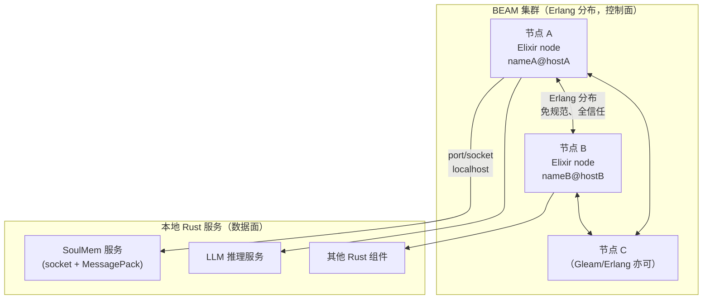
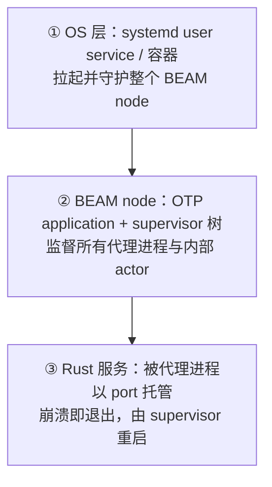
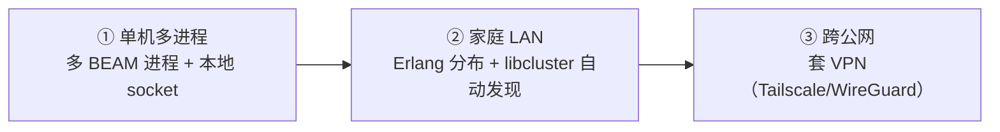

# SoulMem 集群架构说明书

> 本文档定义 SoulMem 所属角色扮演系统的分布式集群架构，是 `orchestration.md` 中
> "通过 Zenoh pub/sub "这一传输层设想的**替代方案**。二者在传输与运行时
> 选型上冲突时，以本文档为准。

---

## 0. 文档定位与决策记录

本文档是集群层的**权威说明**，覆盖：节点模型、通信协议、监督与失败清理、部署拓扑、
信任模型与风险。所有未实现项以 🔲 标注，已实现项以 ✅ 标注，沿用仓库既有约定。

### 决策记录（ADR）

| 决策项     | 结论                     | 主要理由                                              |
| ------- | ---------------------- | ------------------------------------------------- |
| 运行时     | BEAM（Erlang VM）        | 天生面向分布式；OTP 提供进程监督、link/monitor 失败传播、supervisor 树 |
| BEAM 语言 | Elixir                 | 生态成熟（`libcluster`、`msgpax` 等现成）；OTP 文档/社区答案密度最高   |
| 重计算组件   | 保持 Rust **长命服务**       | llama.cpp / candle 原生推理、巩固/遗忘长循环不适合放进 BEAM 进程     |
| 数据面协议   | MessagePack + 4 字节长度前缀 | 跨语言覆盖最广、与 `serde` 无缝、二进制紧凑、无 codegen              |
| 控制面传输   | Erlang 分布（现阶段）         | BEAM 语言免规范直接互通，30 年成熟                             |
| 信任模型    | 现阶段统一全信任集群             | 降低开发压力；风险向用户披露（见 §7）                              |

---

## 1. 架构总览

系统由两类实体组成，通过两条不同性质的通道互联：



**两条通道，性质完全不同：**

| 通道          | 参与者        | 机制                                 | 是否需自定义规范 |
| ----------- | ---------- | ---------------------------------- | -------- |
| BEAM ↔ BEAM | 各 BEAM 节点  | Erlang 分布（EPMD + cookie + 分布式协议）   | 否（VM 内置） |
| BEAM ↔ 本地服务 | 本机 Rust 进程 | socket / port + 长度前缀 + MessagePack | 是（见 §4）  |

> 关键点：**跨机通信永远只发生在 BEAM↔BEAM 之间**；Rust 服务永远只与**本机** BEAM 节点
> 通信，不跨机。这样"跨机"的复杂度被完整外包给 Erlang 分布，Rust 侧无需感知网络拓扑。

---

## 2. 逻辑节点模型

**一个逻辑节点 = 一个本地后台服务（任意语言） + 一个本机 BEAM 代理进程（GenServer）。**

```text
逻辑节点 N
├── Rust 后台服务（长命，有状态）         ← 真正的计算/存储单元，如 SoulMem
└── BEAM 代理进程（GenServer，ambassador）← 唯一对外入口
      ├─ 负责与 Rust 服务收发消息、翻译为 BEAM 消息
      ├─ 由 supervisor 托管，崩溃时自动重启
      └─ 对外只暴露一个 GenServer pid/名字，集群其他节点只认它
```

- 集群内其他节点**只认识代理进程**，完全不关心其背后是 Rust 还是别的语言。
- 代理进程是 BEAM 世界的一等公民，因此自然获得：名字注册、跨节点 `rpc`、`monitor`、监督。
- Rust 服务是**长命服务**（`restart: :permanent`），只在崩溃时重启，不会因正常退出被替换。
  这正好表达 SoulMem "必须长期执行巩固/遗忘"的语义。

---

## 3. 监督与失败清理

这是本架构的核心能力，全部复用 OTP，无需自研。

### 3.1 三级恢复层级



- ① 保证 BEAM node 本身崩了也能被拉起（OTP 管不到自己）。
- ② 保证 node 内的进程崩溃被隔离、被按策略重启。
- ③ 保证 Rust 服务的崩溃被检测、被重启，且其依赖者收到通知。

### 3.2 依赖的自动逆栈清理

OTP 对**树形依赖**开箱即用：

| 机制                        | 语义                                          | 对应需求               |
| ------------------------- | ------------------------------------------- | ------------------ |
| `link`                    | A link B，B 崩溃 → 退出信号传播给 A                   | 依赖死了，依赖者跟着死        |
| `monitor`                 | A monitor B，B 崩溃 → A 收到 `{:DOWN, ...}` 自行清理 | 依赖死了，依赖者执行清理       |
| supervisor `rest_for_one` | 子进程按顺序启动；某个崩溃 → 它及**其后的所有**子进程一起重启          | "依赖崩了，下游依赖者逆序清理重建" |
| supervisor 逆序关闭           | 关闭时按启动逆序终止（后启的先停）                           | 字面意义的"逆栈清理"        |
| application 依赖            | `applications: [B]` → 启 A 必先启 B；停 B 先停 A    | 跨应用逆序关闭            |

**实践约定**：supervisor 中按"依赖者靠后"的顺序 `start_child`（先启动底层服务 C，再 B，再 A），
并配 `rest_for_one`，即可让 C 崩溃时 C、B、A 依次重启。

### 3.3 节点 down → 依赖清理

- 节点内进程崩溃：`monitor` 收到 `DOWN` → 代理进程通知其上游 → supervisor 逆序重启。
- 整个节点断开：其他节点上对它的 `Node.monitor(node)` 收到 `{:nodedown, node}` →
  清理该节点名下的所有会话/角色状态 → 触发依赖者重启。

> 注意 OTP 语义：**"不可达"即视为 down**。它无法区分"机器真崩"与"网络分区"，
> 跨公网时需要防 split-brain（见 §7.3）。

### 3.4 SoulMem 集成示意（Elixir）

```elixir
defmodule SoulMem.Server do
  use GenServer

  def start_link(opts) do
    GenServer.start_link(__MODULE__, opts, name: __MODULE__)
  end

  def init(opts) do
    # 以 OS 进程方式托管 Rust 服务；:exit_status 使崩溃可被感知
    port = Port.open({:spawn_executable, soulmem_bin()}, [:binary, :exit_status])
    {:ok, %{port: port, sock: nil}, {:continue, :connect}}
  end

  def handle_continue(:connect, state) do
    case :gen_tcp.connect(~c"127.0.0.1", port_number(), [:binary, active: true, packet: 4]) do
      {:ok, sock} -> {:noreply, %{state | sock: sock}}
      _           -> {:noreply, state, {:continue, :connect}}  # 退避重连
    end
  end

  # Rust 进程崩溃 → 通知依赖清理 → 交由 supervisor 重启
  def handle_info({_, {:exit_status, code}}, state) do
    SoulMem.Dependents.handle_down()
    {:stop, {:soulmem_exited, code}, state}
  end

  # socket 断开（服务掉线）→ 同理
  def handle_info({:tcp_closed, _sock}, state) do
    SoulMem.Dependents.handle_down()
    {:noreply, %{state | sock: nil}, {:continue, :connect}}
  end
end
```

supervisor 中配 `child_spec(SoulMem.Server, restart: :permanent)`。

---

## 4. 通信协议规范（数据面）

仅用于 **BEAM ↔ 本机 Rust 服务**。BEAM↔BEAM 不需要本节内容。

### 4.1 线协议（Framing）

```text
[ 4-byte big-endian length ][ MessagePack payload ]
```

- BEAM 侧：`:gen_tcp` / `open_port` 加 `{:packet, 4}` 即可，内建免手写。
- Rust 侧：`tokio_util::codec::LengthDelimitedCodec` 与之对应。

### 4.2 编码约定（跨语言必须钉死）

| 约定    | 规则                                  |
| ----- | ----------------------------------- |
| 结构体编码 | 一律编码为 **map**（字段名作 key），禁用 array 编码 |
| 字符串   | 文本一律用 `str`（UTF-8）；`bin` 仅用于原始字节    |
| 整数    | 显式区分有符号/无符号，两侧类型一致                  |

> 这是 MessagePack 跨语言唯一比 JSON 多出的成本，但只需在文档写死三条即可互读。

### 4.3 消息信封

所有数据面消息都套一个统一信封：

| 字段         | 类型           | 说明                                                      |
| ---------- | ------------ | ------------------------------------------------------- |
| `protocol` | `str`        | 协议名 + 主版本，全局唯一，如 `"soulplan.plugin.v1"`                 |
| `msg_id`   | `str`        | UUID，用于请求-响应对应                                          |
| `kind`     | `str`        | `"req"` \| `"res"` \| `"event"`                         |
| `service`  | `str`        | 目标服务名，如 `"soulmem"`（现阶段按服务名路由）                          |
| `op`       | `str`        | 操作名，如 `"submit_event"` / `"retrieve"` / `"consolidate"` |
| `payload`  | map          | 具体参数/结果                                                 |
| `err`      | `str` \| nil | 仅 `res` 携带，非空表示失败                                       |

- `plugin` / `capability` / `cap_version` 等字段 🔲 预留，待引入能力注册（见 §8）后启用。
- `event` 用于推送（如"巩固完成"、"记忆更新"），无 `msg_id` 可省略。

### 4.4 SoulMem 首版操作集 🔲

| op             | kind  | 说明                    |
| -------------- | ----- | --------------------- |
| `submit_event` | req   | 提交事件增量                |
| `retrieve`     | req   | 触发检索，返回 MemoryNote 集合 |
| `consolidate`  | req   | 强制触发巩固                |
| `forget`       | req   | 强制触发遗忘                |
| `heartbeat`    | event | 周期性存活/状态上报            |

具体 payload schema 由 `soul-mem-core` 的 `serde` 类型为准，两端各 derive/定义一次即可。

---

## 5. 部署拓扑演进

三者是**同一套代码**的渐进形态，仅配置不同。



### 5.1 单机多进程（主要场景 ✅）

- 一台机器上：一个（或少数）BEAM node + 若干 Rust 服务，经 `127.0.0.1` socket/port 通信。
- 若需多进程隔离，可起多个 node，彼此仍走 Erlang 分布。

### 5.2 家庭 LAN 多机 🔲

- 节点名 `name@ip` 或 `name@hostname.local`；共享同一 cookie。
- 用 `libcluster` 的 `Epmd` / `Gossip` 策略实现旧设备自动入网。
- 旧设备只跑 BEAM node（轻量）做协调/世界状态，重推理留在主力机。

### 5.3 跨公网（VPN 伪装成 LAN）🔲

- **内网穿透/端口转发不适用**：Erlang 分布需要节点间双向、多端口、对等连接。
- **VPN（Tailscale / ZeroTier / WireGuard）适用**：让远端机器获得同一私网段的稳定虚拟 IP，
  对 BEAM 而言远端节点就变成"局域网里多了一台机器"，代码无需改动。
- 需调 `net_ticktime` 拉长检测窗口，避免公网抖动造成"假 nodedown"。

---

## 6. 语言可替换性

本架构**绑定"运行时"与"协议"，不绑定具体语言**：

- **控制面**：任何编译到 BEAM 字节码的语言（Erlang / Elixir / Gleam）都是集群一等公民，
  经 Erlang 分布直接互通，且可**混布、逐节点灰度替换**，不停机。语言可换，VM 能力不变。
- **数据面**：任何实现"socket + 长度前缀 + MessagePack"的语言都可作为叶子服务接入
  （Rust/Go/Python/C++/... 均有成熟库），藏在 BEAM 代理之后。

> 这意味着团队将来若想从 Elixir 迁到 Gleam，或新增 Go/Python 服务，都不需要推翻架构。

---

## 7. 信任模型与安全风险 ⚠️

### 7.1 现阶段策略：统一全信任集群

为降低开发压力，**现阶段所有节点一律直接加入 Erlang 分布集群，不做信任分级**。
这是明确的有意取舍，其风险如下，**请向最终用户如实披露**：

| 风险              | 说明                                                                                              |
| --------------- | ----------------------------------------------------------------------------------------------- |
| **Cookie 即全权限** | Erlang 分布靠共享 cookie 认证；持有 cookie 的节点可对任意节点执行任意 `rpc`、读取/篡改进程状态、杀掉任意进程。它不是"接入一个窄 API"，而是"拿到全屋钥匙" |
| **远程任意代码执行**    | `rpc` 可在远程节点执行任意模块函数；一个恶意/有缺陷的节点足以控制整个集群                                                        |
| **模块命名冲突**      | BEAM 模块是平铺 atom，无真命名空间；第三方插件撞名会直接冲突                                                             |
| **崩溃波及范围**      | 进程隔离良好，但 VM 级故障（OOM、NIF segfault、内存耗尽）会带走整个 node 及其上的全部会话                                       |
| **默认无加密无认证**    | 原生分布不加密；需 OTP 26+ 的 TLS distribution 才有传输加密                                                     |
| **端口暴露**        | EPMD 4369 + 一组动态端口；误暴露到公网即面临上述全部风险                                                              |

### 7.2 现阶段缓解措施

- 仅限**家庭可信环境**使用；不将任何节点暴露到公网。
- 使用**高熵长 cookie**（而非默认或弱口令）。
- 防火墙限制 EPMD 与动态端口范围仅在受信网段可达。
- 跨公网时必须套 VPN（自带加密认证），并叠加 TLS distribution。

### 7.3 未来方向 🔲

- **trusted / untrusted 分级**：可信节点进集群；不可信第三方插件降级为"socket 服务"经代理接入，
  进程隔离 + 崩溃隔离 + 命名隔离，不接触集群 cookie。
- **能力注册 + 契约**：引入 manifest（`provides` / `requires` + semver）、启动时依赖校验、
  能力路由，取代现在的"按服务名路由"。
- **防 split-brain**：跨公网时明确状态的单一归属，避免双方误判对方 down 后各自接管同一状态。

---

## 8. 与现有组件的关系

- `soul-mem-core / query / runtime / algo`：**不变**，仍为 Rust 库；对外暴露为长命服务。
- `soul-tune`：CLI 基准测试工具，与集群无关，维持现状。
- `orchestration.md`：其检索管线/状态机/数据模型仍然有效；仅"Zenoh + gRPC 传输"部分被本文档取代。
- SurrealDB 持久化：仍由 Rust 服务直接访问；BEAM 层不接触数据库。

---

## 9. 待办

- [ ] 定义 SoulMem 首版消息 schema（§4.4 各 op 的 payload）。
- [ ] 最小闭环验证：Elixir 控制面 + Rust 假服务 + `rest_for_one`，kill 后验证自动重启与逆序清理。
- [ ] 引入 `libcluster`，打通 LAN 双机自动发现。
- [ ] 评估 TLS distribution（OTP 26+）与 VPN 组合的跨公网方案。
- [ ] 设计 trusted/untrusted 分级与能力注册（§8）。
