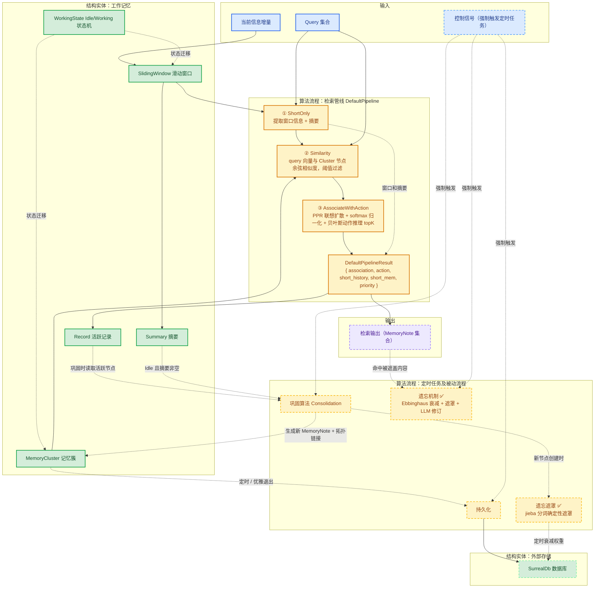
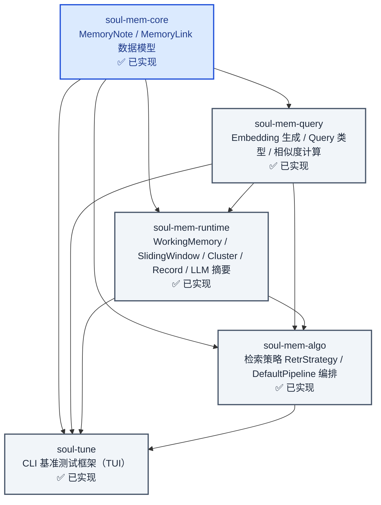
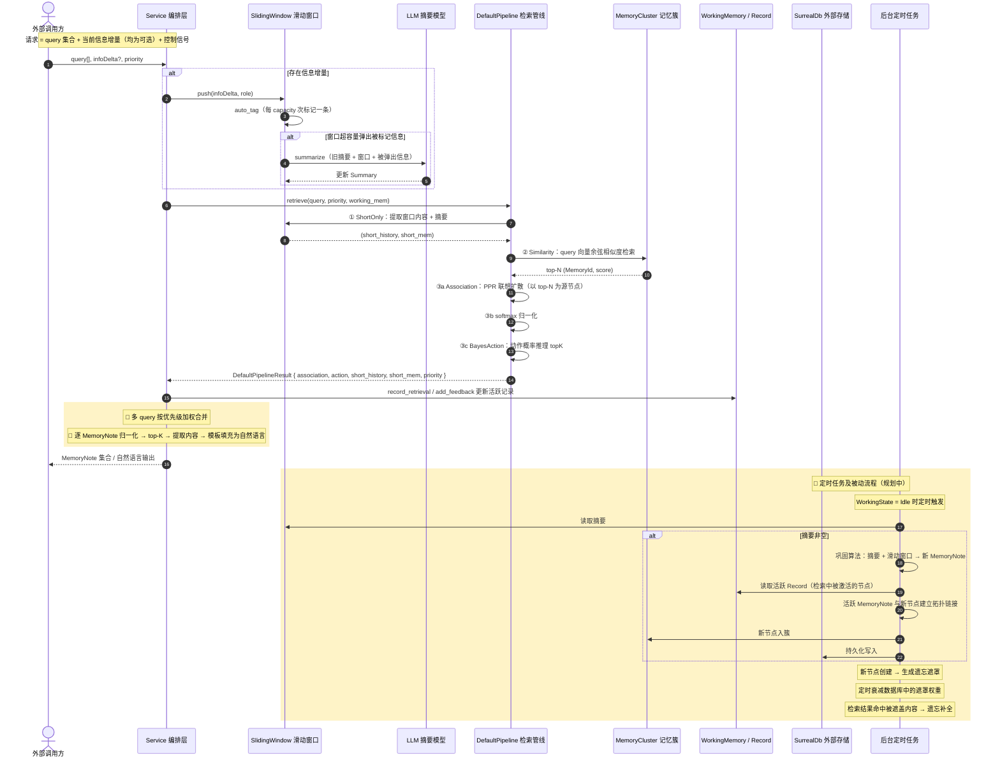

# SoulMem Orchestration

## 总述

SoulMem Orchestration主要指在SoulMem各个功能单元编写完成的情况下，将他们串联起来以形成按预期工作的流程的过程。

对外部，SoulMem以服务形式提供，通过zenoh的pub/sub，query，liveliness api以及通过grpc 🔲。服务的输入是query集合和当前信息增量（均为可选字段），输出是检索到的MemoryNote集合，其余组件均用于维护SoulMem自身的状态（巩固，遗忘等)

此外，服务的输入还有一组控制信号，用于强制触发一些定时任务 🔲

流程描述如下：

### 图例

色彩按**角色/类型**区分，实线 = 已实现，虚线 = 设计规划中（尚未实现）：

| 角色类型 | 填充色 | 已实现（实线） | 规划中（虚线） |
|---------|--------|:---:|:---:|
| 输入 | 蓝色 | ✅ | 🔲 |
| 输出 | 紫色 | — | 🔲 |
| 结构实体 | 绿色 | ✅ | 🔲 |
| 算法流程 | 橙色 | ✅ | 🔲 |

## 各 Crate 依赖与交互关系

代码按以下 5 个 crate 分层组织，箭头表示依赖方向（被依赖方 → 依赖方）。

- `soul-mem-core`：纯数据模型，无任何内部依赖，是其余 crate 的基础。
- `soul-mem-query`：依赖 core，负责文本→向量嵌入（BGE/Qwen3 模型）与查询类型定义。
- `soul-mem-runtime`：依赖 core、query，维护工作记忆（滑动窗口、记忆簇、活跃记录）并封装 LLM 摘要调用。
- `soul-mem-algo`：依赖 core、query、runtime，实现全部检索策略，其中 `RetrDefaultPipeline` 串联三步构成完整检索管线。
- `soul-tune`：依赖全部 crate，是用于基准测试的命令行工具，非运行时组件。

> 注：`soul-mem-runtime` 对 `soul-mem-algo` 的依赖仅存在于 `dev-dependencies`（测试用），生产依赖图中不存在反向依赖。

## 查询请求完整生命周期

一次完整检索请求从外部输入到最终输出的时序如下。颜色含义与主图一致（见上文图例），橙色矩形内的内容为规划中。

## 行为流程说明

> **状态更新（2026-08）**：遗忘机制已实现（`soul-mem-algo/src/algo/forget/`：
> `ebbinghaus_decay` 衰减曲线、`mask_text` 文本遮罩、`lazy_forget` 三档
> NoAction/MaskOnly/Revised），并由 `soul-tune run forget` 评测。巩固/持久化仍为 🔲。

当没有query输入时，信息增量被压入滑动窗口，之后可能会触发滑动窗口的summary机制，并生成新的摘要 ✅

当只有query时，走检索算法的DefaultPipeline，得到DefaultPipelineResult，一份query对应一个DefaultPipelineResult ✅，后续根据query的优先级，以每一个MemoryNote为单位，将分数加权平均，取top-k并提取记忆内容，按照模板填充为自然语言，输出 🔲

当query和信息增量同时存在时，先执行信息增量压入，summary完成后执行检索算法 ✅

当工作记忆状态为Idle时，每隔一段时间，如果摘要不为空，执行巩固算法，它根据摘要和滑动窗口生成新的MemoryNote并建立与Cluster的拓扑链接 🔲

活跃记录（Record）追踪检索中被激活的MemoryNote；巩固时，被标记为活跃的MemoryNote将作为新生成节点的候选拓扑链接目标 🔲

当工作记忆状态为Idle时每隔一段时间，或服务优雅退出时，将工作记忆节点写入数据库持久化 🔲

每当新节点被巩固算法创建时，生成遗忘遮罩 🔲

每隔一段时间，衰减数据库中遗忘遮罩权重 🔲

每当含有“被遮盖”的文本的MemoryNote作为检索算法的最终结果时，调用遗忘补全 🔲

## 外部接口

除了上述的服务输入外，还提供额外的接口（均规划中 🔲）

- 对指定id的MemoryNote读写
- 控制信道，强制触发上述的定时任务
- liveliness/heartbeat

