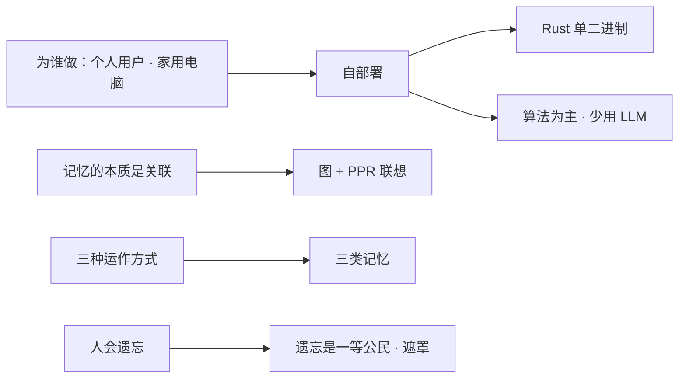

# 总体架构

上一章（核心概念）我们已经知道 SoulMem 是什么：一个以图组织记忆、用三层结构存放记忆、让角色像人一样记忆与遗忘的系统。这一章我们把视角拉高，回答另一个问题：**这些概念是如何组装成一个可以运行的系统？**

> [!note]
> 本文档描述 SoulMem 当前的总体架构（依据 `feature/test_framework` 分支的代码状态整理）。历史设计文档（如旧的 `beta_ver.md` 设计愿景）中的过时内容不再作为当前架构依据，相关演进记录见文末"与旧设计的差异"。

## 1. 项目定位

SoulMem 是一个专为**角色扮演任务**设计的记忆系统。它**旨在**使 LLM 的输出更拟人化，让模拟角色像人一样记住重要的、情感相关的、可驱动行为的事件并建立关联；**不旨在**精确无误地记忆事件细节或事实性知识。

- 面向**个人用户**、在**家用电脑**上运行，非企业级解决方案；
- 核心设计哲学：**一切特征和事件都属于记忆**——角色性格、口癖、行为习惯等都是长期记忆交互演化的结果，而非静态角色卡；
- 实现语言：Rust（workspace 多 crate 结构）。

## 2. 高层设计决策

在深入模块之前，先回答一个总问题：**SoulMem 为什么长成了今天这个形态？** 答案由几个"为什么"叠加而成——核心概念部分已经讲过"为什么分三类记忆、为什么用图、为什么分三层"，下面把其余的决策集中在一起。

### 2.1 为谁而做：个人用户、家用电脑

赛博生命的典型场景是**个人的长期陪伴**。要把陪伴真正交到普通人手里，有三个硬性条件：**必须能自部署**、**目标硬件是家用笔记本电脑**、**用户不是开发者**。

其中"自部署"不是工程偏好，而是产品灵魂问题：

- **隐私**：陪伴意味着大量私密信息。把数据留在自己电脑上，是唯一让人安心的方案；
- **可靠性**：**陪伴不能"被迫离开"**。政策变化、公司运营变化都可能让云端服务终止；自部署意味着只要你的电脑还在，你的数字伙伴就还在；
- **大众可及**：赛博生命不应该是有钱人的玩具。自部署 + 家用电脑运行，让"拥有一个数字伙伴"成为普通人也能负担、也能掌控的事情。

> 试想一个陪伴了你半年的角色，因为一条"服务将于下月停运"的公告而永远消失——这是用户最难以接受的事。自部署把这种风险从产品里拿掉了。

这三个条件直接决定了技术形态（详见下文 Workspace 结构）：

| 约束 | 后果 |
|------|------|
| 家用笔记本（资源受限） | 不能跑超大模型 → 算法为主、少用 LLM |
| 用户不是开发者 | 一键运行 → 编译为单个二进制，双击就能跑 |
| 没有云端基础设施 | 数据落在本地，不依赖外部数据库服务 |

### 2.2 能不用 LLM，就不用 LLM

这是 SoulMem 最重要的一条设计原则：

> [!important]
> **能不用 LLM，就不用 LLM。让 LLM 只在最关键的地方发挥作用。**

原因非常现实：

- **本地算力**：个人用户跑不动足够强的模型，同时还要轻松地用电脑干别的；
- **成本**：token 消耗是真金白银，而角色扮演场景的**缓存命中率通常很低**——每次对话都是新内容；
- **延迟**：LLM 的响应是秒级的，频繁调用会拖垮对话体验。

所以 SoulMem 的策略是：**用精心设计的数据结构和算法，完成绝大部分记忆工作**——检索、联想（PPR）、相似度、遗忘衰减、连接强度调整，全部是确定性算法，零 LLM 调用。LLM 只做那些真正需要"理解"和"生成"的事：

- 把一段对话**摘要/拆解**成记忆节点（巩固）；
- 对**被遮罩的记忆做猜补**（遗忘修订）；
- （外部）根据检索结果生成角色的回复。

### 2.3 记忆用图组织，联想用 PPR

记忆的本质是**关联**。向量搜索适合"相似"，却不知道"连接"：它找不到"意大利面"与"42号混凝土"之间的联系，也凑不齐"姚明 → 叶莉 → 出生地"这样的多跳链路。**图把连接显式地画出来**——节点是记忆，边是带权重的关联——联想因此变成一件"图上自然发生"的事。

这个想法来自调研阶段的两位参考：

- **A-mem**：图结构的启蒙——记忆不是一堆独立的片段，而是互相连接的节点；
- **HippoRAG**：PPR 联想的来源——用知识图谱存储记忆，检索时用 Personalized PageRank 在图上扩散。

联想的具体算法是 **PPR（Personalized PageRank）**，它的直觉是一个随机游走者：

> 想象一个小人在记忆图上随机游走。每一步，它要么沿一条边走到下一个节点，要么以概率 1−α "回家"（重启回起点）。走足够久之后，停在每个节点的频率，就是"每个节点相对起点的联想强度"。

这个建模天然对应人的联想：**多跳**可达（小人可以走很多步）、**尊重边权**（连接越强越想得起）、**有焦点**（不断重启，不会漫无目的地发散）。SoulMem 默认阻尼因子 α = 0.65，是一个偏发散的取值——角色扮演需要天马行空的联想。

### 2.4 三类记忆：自进化的前提

认知科学把记忆分为**情境、语义、程序性**三类，这个划分恰好对应三种完全不同的运作方式：**经历、知识、行为**。SoulMem 直接借鉴了这个分类，让每一类记忆都有自己的结构、自己的算法、自己的生命周期。

为什么必须分开？因为**自进化本质上是"把一种记忆加工成另一种记忆"**：反复发生的情境抽象成语义记忆（"用户喜欢辣"），反复出现的行为长成程序性记忆（"紧张就摸辫子"）。而"加工"要求系统**知道每种记忆的形态**——当所有记忆都被塞进同一个无结构节点时（alpha 版本的教训），自进化算法就没有操作对象。

> [!important]
> 这正是：**一切特征和事件都属于记忆**——性格、口癖、行为习惯，都不是写在静态角色卡上的，而是记忆系统演化的结果。

### 2.5 遗忘是一等公民

很多记忆系统的目标是"记住一切"。但一个什么都记得的角色反而显得不真实：

- **琐碎会淹没重点**：如果十年前的琐碎细节和昨天的约定同样醒目，真正重要的记忆反而被淹没；
- **精确记得每句话不像陪伴，更像监控**：人记住的是"重要的、情感相关的、能驱动行为的"，这个筛选本身就是"在乎"的表现；
- **永不淡去的记忆会把角色钉死在过去**：遗忘给了角色"放下"的能力。

SoulMem的遗忘机制被设计遵循**艾宾浩斯曲线**：刚记住时忘得最快，之后越来越慢；被反复回忆的内容遗忘得更慢。遗忘的方式是**遮罩而不是删除**——细节逐渐模糊，大意保留，像人一样"想不起来"而不是"不存在"；重度遗忘时，系统还会基于剩余内容调用 LLM **猜补**，模拟人"努力回忆"的过程。

> [!warning]
> 遗忘是有争议的机制，很多主流记忆系统都在回避它。但角色扮演场景下，遗忘是角色"会变"的来源之一——这也是 SoulMem 与大多数记忆系统最不一样的地方。

### 2.6 总结

把上面的决策收拢，SoulMem 的形态来自三个核心设计决策 + 一条总原则：

1. **三类记忆**：情境 / 语义 / 程序性，各自独立的结构和处理方式（自进化的前提）；
2. **图 + PPR**：用图组织全部记忆，用 PPR 做联想（HippoRAG 的启发）；
3. **遗忘是一等公民**：模拟遗忘曲线，模糊而非删除（角色"会变"的来源之一）。

再加上"能不用 LLM 就不用 LLM"这条总原则，答案已经很明显：**SoulMem 选择自己设计记忆系统，而不是套用一个现成的 RAG 框架**——现成的框架是为"精确检索"设计的，而我们需要的是"像人一样的记忆"。这个差别，决定了后面所有的设计。

## 3. Workspace 结构

| Crate | 职责 |
|-------|------|
| `soul-mem-core` | 记忆数据模型：三类记忆（情境/语义/程序性）的节点与链接、ID 体系 |
| `soul-mem-algo` | 记忆算法：检索/联想（PPR 系列）、遗忘、巩固 |
| `soul-mem-query` | 嵌入与查询：embedding 模型接入、查询构建、相似度计算、检索计算 |
| `soul-mem-runtime` | 运行时：工作记忆（滑动窗口 + LLM 客户端）、记忆簇（图存储与并发访问） |
| `soul-tune` | 测试/评测框架（TUI）：批量检索评测、playtest、遗忘/巩固评测 |
| `benches` | 基准测试（PPR 性能） |

依赖与集成要点（依据 `Cargo.toml`）：

- **LLM 调用**：`soul-mem-runtime` 使用 `async-openai`（OpenAI 兼容 API，可指向本地 llama.cpp server 或任意兼容端点），`soul-tune` 提供 `LlamaServer` / `Candle` / `Qwen3.5` 等评测后端。
- **嵌入模型**：`soul-mem-query` 使用 `candle-core` + `embed_anything`，支持 BGE 与 Qwen3 嵌入模型，`text-splitter` 做长文本分块。
- **图结构**：`petgraph::StableDiGraph` 承载记忆图（工作记忆/记忆簇）。
- **未使用**：当前代码**不依赖** SurrealDB、Qdrant、zenoh、gRPC（旧设计文档中的设想，见下文差异说明）。

### 运行形态

运行时以一个简单的两态状态机组织：**Working**（处理请求）与 **Idle**（空闲）。巩固等定期任务只在 Idle 状态下执行。状态迁移与检索时序详见 [编排与数据流](orchestration.md)。

## 4. 记忆图：概念与数据模型

记忆以图的方式组织：**节点是记忆（情境 / 语义 / 程序性），边是带权重的记忆关联**。概念层面——记忆是什么、为什么分三类、关联是什么——已经在 [核心概念 · 记忆图](../concepts/memory-graph.md) 讲过，这里不再重复；数据结构层面——每个节点、每条边在代码里长什么样——见 [记忆模型](memory-model.md)。

系统的其余部分都建立在这张图上：**长期记忆**是持久化的全部记忆，**工作记忆**是从长期记忆激活的子图，**滑动窗口**是最近几轮对话。它们的协作方式见 [编排与数据流](orchestration.md)。

## 5. 与旧设计（beta_ver）的差异

| 旧设计（beta_ver.md 愿景） | 当前实现 |
|---------------------------|---------|
| SurrealDB 作为向量/图/时间序列数据库 | 无数据库依赖；记忆图在内存（petgraph）中，持久化通过文件/测试夹具 |
| async-openai 调用外部 LLM API | 保留 async-openai（可指向本地兼容端点），soul-tune 另有 Candle/LlamaServer 后端 |
| zenoh pub/sub 服务接口 | 未实现（orchestration 中的规划） |
| gRPC 接口 | 未实现 |
| 分块懒加载子图（长期记忆 → 工作记忆） | 测试框架直接加载完整图到 MemoryCluster；懒加载为规划项 |
| EdgePush PPR | 已实现 `weighted_ppr_fp`（带边权的 PPR）与多策略检索（见 [检索与联想](../algorithm/retrieve.md)） |
| 巩固/整合机制 | `soul-tune` 已有巩固评测框架；运行时整合为规划项 |

> 更完整的模块级细节见 [Crate 参考](../crates/soul-mem-core.md) 各章，检索算法细节见 [检索与联想](../algorithm/retrieve.md)。

接下来，[记忆模型](memory-model.md) 将展开记忆图的数据结构；[编排与数据流](orchestration.md) 将展示一次对话的完整旅程。
