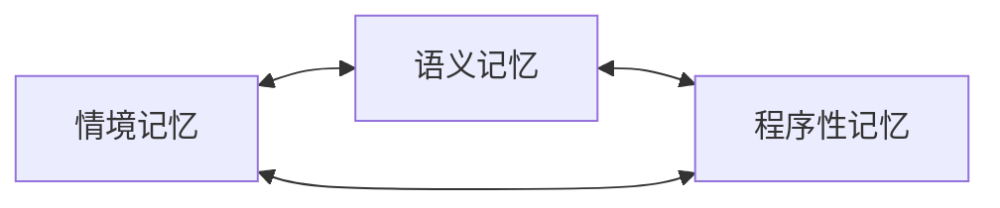

# SoulMem 总体架构

> 本文档描述 SoulMem 当前的总体架构（依据 `feature/test_framework` 分支的代码状态整理）。
> 历史设计文档（如旧的 `beta_ver.md` 设计愿景）中的过时内容不再作为当前架构依据，
> 相关演进记录见文末"与旧设计的差异"。

## 1. 项目定位

SoulMem 是一个专为**角色扮演任务**设计的记忆系统。它**旨在**使 LLM 的输出更拟人化，
让模拟角色像人一样记住重要的、情感相关的、可驱动行为的事件并建立关联；**不旨在**
精确无误地记忆事件细节或事实性知识。

- 面向**个人用户**、在**家用电脑**上运行，非企业级解决方案。
- 核心设计哲学：***"一切特征和事件都属于记忆"***——角色性格、口癖、行为习惯等都是
  长期记忆交互演化的结果，而非静态角色卡。
- 实现语言：Rust（workspace 多 crate 结构）。

## 2. Workspace 结构

| Crate | 职责 |
|-------|------|
| `soul-mem-core` | 记忆数据模型：三类记忆（情境/语义/程序性）的节点与链接、ID 体系 |
| `soul-mem-algo` | 记忆算法：检索/联想（PPR 系列）、遗忘、巩固 |
| `soul-mem-query` | 嵌入与查询：embedding 模型接入、查询构建、相似度计算、检索计算 |
| `soul-mem-runtime` | 运行时：工作记忆（滑动窗口 + LLM 客户端）、记忆簇（图存储与并发访问） |
| `soul-tune` | 测试/评测框架（TUI）：批量检索评测、playtest、遗忘/巩固评测 |
| `benches` | 基准测试（PPR 性能） |

依赖与集成要点（依据 `Cargo.toml`）：

- **LLM 调用**：`soul-mem-runtime` 使用 `async-openai`（OpenAI 兼容 API，可指向本地
  llama.cpp server 或任意兼容端点），`soul-tune` 提供 `LlamaServer` / `Candle` / `Qwen3.5`
  等评测后端。
- **嵌入模型**：`soul-mem-query` 使用 `candle-core` + `embed_anything`，支持 BGE 与
  Qwen3 嵌入模型，`text-splitter` 做长文本分块。
- **图结构**：`petgraph::StableDiGraph` 承载记忆图（工作记忆/记忆簇）。
- **未使用**：当前代码**不依赖** SurrealDB、Qdrant、zenoh、gRPC（旧设计文档中的设想，
  见下文差异说明）。

## 3. 记忆图模型

记忆整体以**图**方式组织，由三类子图构成：

### 3.1 情境记忆（Situation / Episodic）

记忆具体事件经历。节点分两类：

- **具体情境（SpecificSituation）**：`narrative`（自然语言叙述）、`time_span`（时间）、
  `context`（上下文）。
- **抽象情境（AbstractSituation）**：`Location`（地点）、`Participant`（参与者）、
  `Environment`（环境）、`Event`（事件）四种类型之一，作为具象情境的**二级索引**与
  子图间接口节点。

`Context` 结构（`soul-mem-core/src/memory_note/situation_mem.rs`）：

| 字段 | 类型 | 说明 |
|------|------|------|
| `location` | `Option<Location>` | 发生地点（name + coordinates） |
| `participants` | `Vec<Participant>` | 参与者（name + role） |
| `emotions` | `Vec<Emotion>` | 情感（name + intensity） |
| `sensory_data` | `Vec<SensoryData>` | 感官数据（name + intensity） |
| `environment` | `Environment` | 环境（atmosphere + tone） |
| `event` | `Vec<Event>` | 事件（action + action_intensity + initiator + target） |

### 3.2 语义记忆（Semantic）

记忆通用概念、事实与关系（如"北京是中国的首都"）。字段：`content`（概念/事实）、
`aliases`（别名，去重消歧）、`concept_type`（`Entity` 具象 / `Abstract` 抽象）、
`description`（限定描述）。语义记忆是图的中枢核心，承担类似海马体索引的功能。

### 3.3 程序性记忆（Procedural）

存储"肌肉记忆"、条件反射、行为习惯等执行相关记忆（如"沉思时会摸下巴"）。结构上区分：

- **trigger**：情境触发器（由情境记忆提供），在 PPR 结果中不可作为**最终抵达**节点，
  只能作为途径路径。
- **action**：指导性行为自然语言描述（如"否定自己的关心意图"），可进入 LLM 动作提示词。

### 3.4 记忆节点与链接（通用结构）

- `MemoryNote`（`memory_note.rs`）：`id`（UUID newtype）、`tags`、`retrieval_count`、
  `create_time`、`last_accessed_time`、`mem_type`（三类记忆之一）、`mem_links`。
- `MemoryLink`（`memory_links.rs`）：`id`、`from`/`to`（MemoryId）、`intensity`（连接强度，
  遗忘机制的关键载体）、`link_type`（`Proc` / `Sem` / `Situation` 三类链接）。
- 运行时以 `EmbeddedMemoryNote`（记忆 + 嵌入向量）作为图节点存储于
  `MemoryCluster`（`petgraph::StableDiGraph`），通过 `MemoryClusterHandle` 并发访问。

### 3.5 长期记忆与工作记忆

- **长期记忆**：持久化记忆（当前实现以文件/图数据形式在测试框架中加载，见 `fixtures/`）。
- **工作记忆**：运行时从长期记忆激活的子图，使用 petgraph 存储，记忆的修改频繁；
  对话中生成的新记忆首先进入工作记忆。
- **滑动窗口**：记录最近几轮对话（短期记忆），窗口内记忆**无条件**加入最终检索上下文；
  滑出前未被巩固的记忆会丢失。详见 [编排与数据流](orchestration.md)。

## 4. 关键设计原则

1. **能不用 LLM 就不用 LLM**：LLM 回复慢（秒级）且对个人用户有 API 费用。仅在需要复杂
   整合/信息提取的场合使用 LLM，并保证 prompt 质量与较少 token。
2. **工作流而非工具调用**：LLM 作为"末端执行器"，决策逻辑由人构思实现，更可控、更省
   token、对工具调用能力弱的模型更普适。
3. **状态机**：Working / Idle 两态，巩固等定期任务仅在 Idle 允许执行。

## 5. 与旧设计（beta_ver）的差异

| 旧设计（beta_ver.md 愿景） | 当前实现 |
|---------------------------|---------|
| SurrealDB 作为向量/图/时间序列数据库 | 无数据库依赖；记忆图在内存（petgraph）中，持久化通过文件/测试夹具 |
| async-openai 调用外部 LLM API | 保留 async-openai（可指向本地兼容端点），soul-tune 另有 Candle/LlamaServer 后端 |
| zenoh pub/sub 服务接口 | 未实现（orchestration 中的规划） |
| gRPC 接口 | 未实现 |
| 分块懒加载子图（长期记忆 → 工作记忆） | 测试框架直接加载完整图到 MemoryCluster；懒加载为规划项 |
| EdgePush PPR | 已实现 `weighted_ppr_fp`（带边权的 PPR）与多策略检索（见 [检索与联想](../algorithm/retrieve.md)） |
| 巩固/整合机制 | `soul-tune` 已有巩固评测框架；运行时整合为规划项 |

> 更完整的模块级细节见 [Crate 参考](../crates/soul-mem-core.md) 各章，
> 检索算法细节见 [检索与联想](../algorithm/retrieve.md)。
