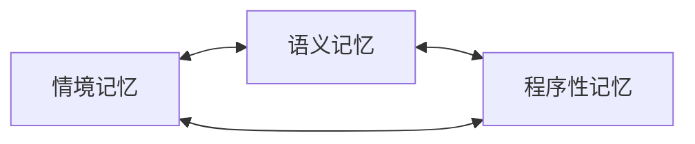

# 核心概念 · 记忆图

SoulMem以图的形式组织记忆。图上的节点被称为记忆节点，边被称为记忆关联。用图的方式组织记忆，实现联想和多跳推理将变得自然。
然而，SoulMem并不只维护一个图，也不只有图一种形式来组织记忆，在稍后的章节会加以详细说明。

记忆图属于角色，其中的内容是以角色视角进行的。

## 记忆节点
SoulMem参考人类的记忆，将记忆节点分为三类：
- 情境记忆（Situation Memory）
- 语义记忆（Semantic Memory）
- 程序性记忆（Procedural Memory）

> *注*：在通常文献中，情境记忆被翻译为Episodic Memory。

 

将记忆节点分类是必要的，因为不同的记忆具有不同的性质与用途，考虑以下**场景**：

想象一个叫"小红"的数字角色，和你相处了三个月。这段时间里，她记住了很多事：

- 上周三你们一起去吃了麻辣烫，她被辣得直喝水（*一件事*）；
- 她喜欢苦的东西，讨厌甜腻的奶茶（*一个事实*）；
- 她每次紧张的时候，会下意识地摸自己的辫子（*一个习惯*）。

这三样东西，本质上完全不同。一个是一段具体的经历，一个是概念性的认知，一个将无意识的指导行为。但很多记忆系统把它们塞进同一个筐里，不加区分。

> 对记忆类别不加区分可能会导致一些问题，在稍后你会见到一些。

### 三类记忆

下面我们将更深入的解释三类记忆

---

#### 情境记忆（Episodic）——"角色经历过什么"

记录**事件**：时间、地点、人物、发生了什么，以及角色当时的感受。下方便是一个情境记忆的示例：

> 2026-07-12 中午，和用户在街角那家麻辣烫店，被辣到了。

情境记忆是"个人经历"。它是时间的切片，有明确的时间戳。

 

情境记忆分为两个子类：
- 抽象情境（abstract）
- 具体情境（specific）

上述举得一个例子即是一个具体情境，每一个具体情境都代表角色确实发生过的经历。而抽象情境是由一系列相似的具体情境抽象出的一种模式，下方列出了一个抽象情境的示例：
> 在咖啡馆喝茶

抽象情境主要作用是作为索引方便对具体情境的联想，以及作为模式触发器触发程序性记忆。对于后者，下文会详细阐述。

 

---

#### 语义记忆（Semantic）——"角色知道什么"

记录**通用的概念、事实和关系**，剥离了时间和地点。例如：

> 用户是我新交的朋友，喜欢苦味，讨厌甜味。

语义记忆像一本知识手册，也是三类记忆的"中枢"：概念之间互相连接，形成一张知识网。

事实上， 角色的自我认知也是一个语义记忆节点，它的内容十分类似于常规角色扮演应用中的**角色卡**。这样的设计让角色自我进化产生可能，在后续的章节中会详细说明。

 

---

#### 程序性记忆（Procedural）——"角色会怎么做"

记录**行为习惯、条件反射、说话方式**，一系列可以执行的行为。

> 紧张的时候摸辫子。 \
> 被关心的时候，嘴上却否认（傲娇）。

程序性记忆不会告诉你"发生了什么"，它告诉你**在什么情境下，这个角色会怎么行动**。

程序性记忆也分为两类：
- 触发器（trigger）
- 动作（action）

trigger通常就是一个抽象情境节点，action代表具体的执行行为。只有当trigger满足时，action才有可能触发，更详细的执行逻辑，请参阅[检索算法](../algorithm/retrieve.md)

 

---

### 为什么对记忆节点进行分类？

如果把三类记忆混在一起，会出现什么问题？我们还是以小红为例：

#### 情境和语义混淆
考虑以下场景，小红在聚餐时说自己喜欢香蕉，但是小红实际上喜欢苹果。我们可能有以下两条记忆：
- 在聚餐时，小红说自己喜欢香蕉，一个情境记忆
- 小红不喜欢香蕉，她喜欢苹果，一个语义记忆

如果记忆节点不加以区分，当这两条记忆同时被检出并放入llm上下文时，矛盾产生了，llm很有可能会得出小红喜欢香蕉的错误结论。一些更聪明的llm可能会经过推理明白小红说自己喜欢香蕉有额外的原因，并非小红的真实喜好，但那会在推理阶段耗费更多的token。

在这种情况下，我们需要额外的上下文来确定哪个是真实信息，分类就是一种简单可行的解决办法。在上述情况下，取决于当前的对话上下文，当用户询问**聚餐时说的话**，情境记忆将成为唯一事实来源，当用户询问**小红的喜好**，语义记忆将成为唯一事实来源。这避免了llm因为上下文信息矛盾而导致的执行混乱，造成ooc（Out of Character）。

> 此处的唯一事实来源是站在**角色视角**说的，是**角色认定的事实**，而不一定是客观真实。

#### 行为和知识混淆
**傲娇**是一种典型的角色标签之一，它的特点可以用“口嫌体正直”来描述，但在让llm扮演该类型角色时，会产生一系列问题：
- 部分模型难以区分**傲娇**和**讨厌**的区别，从而在生成内容中有过于激烈的言辞。
- 部分模型在扮演傲娇类型角色时，过于标签化，刻板印象化，从而造成不真实感

从根本上来说，当你告诉模型这是一个傲娇类型角色时，llm需要推理来知道这类角色的行为习惯。当然，我们也可以使用一些提示词技巧告诉模型应该有的行为。但人类并不是一个规则引擎，在特定情况下，傲娇角色也可能直球攻击。直接把行为固化在角色卡里会造成整个上下文被污染，从而导致僵硬的角色行为。

此外，一个角色"知道"关心别人和"习惯性"地否认关心，是两回事。前者是知识，后者是行为模式。如果混在一起，行为模式就难以被单独触发和演化。

分开之后，每一类记忆都有**自己的结构、自己的算法、自己的生命周期**

> 这也是 SoulMem 的核心设计之一：**一切特征和事件都属于记忆**——性格、口癖、行为习惯，都不是写在静态角色卡上的，而是记忆系统演化的结果。

## 记忆关联
记忆节点之间存在广泛的关联

