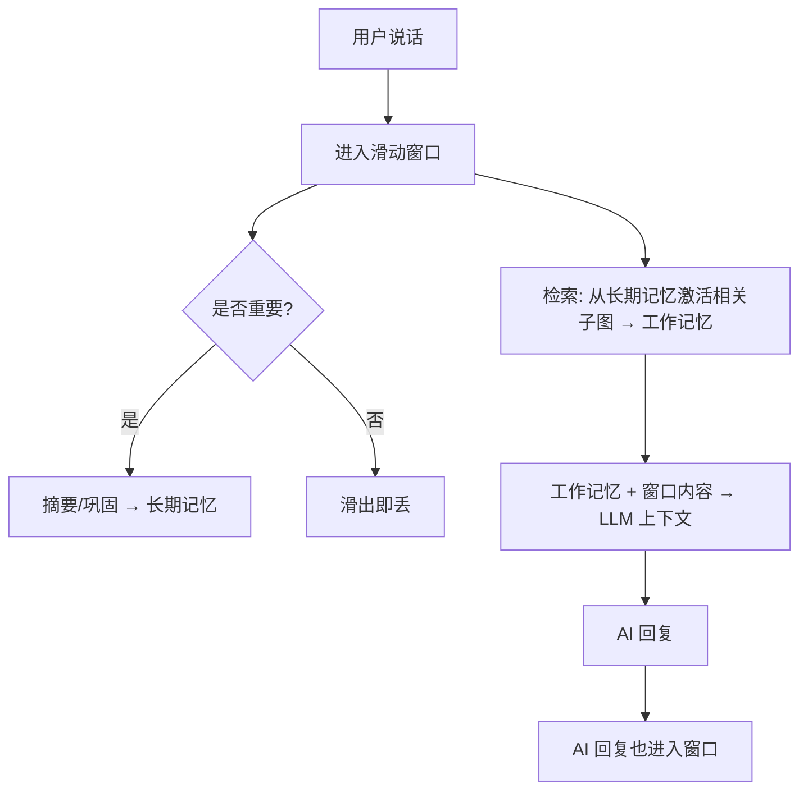

# 核心概念 · 长期记忆、工作记忆与滑动窗口

> 这一章解释三个容易混淆的概念：长期记忆、工作记忆、滑动窗口——以及它们之间怎么配合。

## 三个盒子

### 长期记忆：你的整个人生

长期记忆是记忆系统的"仓库"：所有沉淀下来的情境、语义、程序性记忆，以**图**的形式组织
在这里。它体积大、变化慢，是角色的"人格底座"。

### 工作记忆：你现在正在想的事

工作记忆是"激活"出来的子图——从长期记忆里，把当前对话相关的部分临时取出来使用。

打个比方：长期记忆是你的书房里所有的书；工作记忆是你此刻摊开在桌上、正在读的那几本。

工作记忆有两个特点：

- **它是长期记忆的子图**：不会出现长期记忆里没有的东西。
- **它变化频繁**：对话中产生的新记忆，先进入工作记忆；检索也发生在工作记忆上。

### 滑动窗口：最近几轮对话

滑动窗口是工作记忆的"输入缓冲区"——记录最近几轮用户和 AI 的对话。它模拟人的短期记忆：
容量有限，新的进来，旧的滑出去。

滑出的信息会怎样？

- **重要的**：被摘要、被巩固，进入长期记忆；
- **不重要的**：随窗口滑出而丢失——就像你不记得昨天午饭具体吃了什么。

窗口内最近的对话内容，在检索时**无条件**进入上下文（因为"刚刚说过的话"无论如何都该被
记得）。

## 一次对话的完整旅程

让我们把三个概念串起来，看一次完整对话里发生了什么：

1. 用户说话 → 进入**滑动窗口**；
2. 系统在**长期记忆**（图）上检索，激活相关子图成为**工作记忆**；
3. 窗口内容（短期）+ 工作记忆（联想结果）→ 组成 LLM 的上下文；
4. AI 回复 → 也进入窗口；
5. 窗口滑出的重要信息 → 摘要、巩固 → 写回长期记忆。

## 为什么这样设计

这套结构模仿的是人的认知：

- 人**不能**同时记住所有事 → 滑动窗口限定了"短期"的容量；
- 人**能**想起很久以前的事 → 长期记忆以图组织，支持联想检索；
- 人**会**把反复出现的经历沉淀成习惯和认知 → 巩固机制。

这三层的配合，是 SoulMem 整个系统运转的骨架。后面的章节（设计旅程、系统概览）会逐一
展开每一层的实现细节。

---

*到这里，第一部分（核心概念）就结束了。你已经知道了 SoulMem 是什么、记忆怎么分类、
怎么流转。下一部分我们开始讲"为什么"——为什么用图？为什么用 PPR？为什么遗忘用遮罩？
这些决策背后的故事，才是 SoulMem 的灵魂。*

*下一步：[设计旅程 · 一切的起点](../design/origin.md)*
