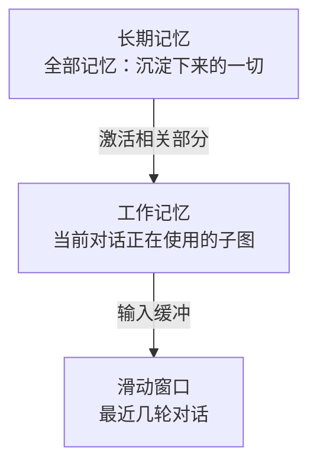
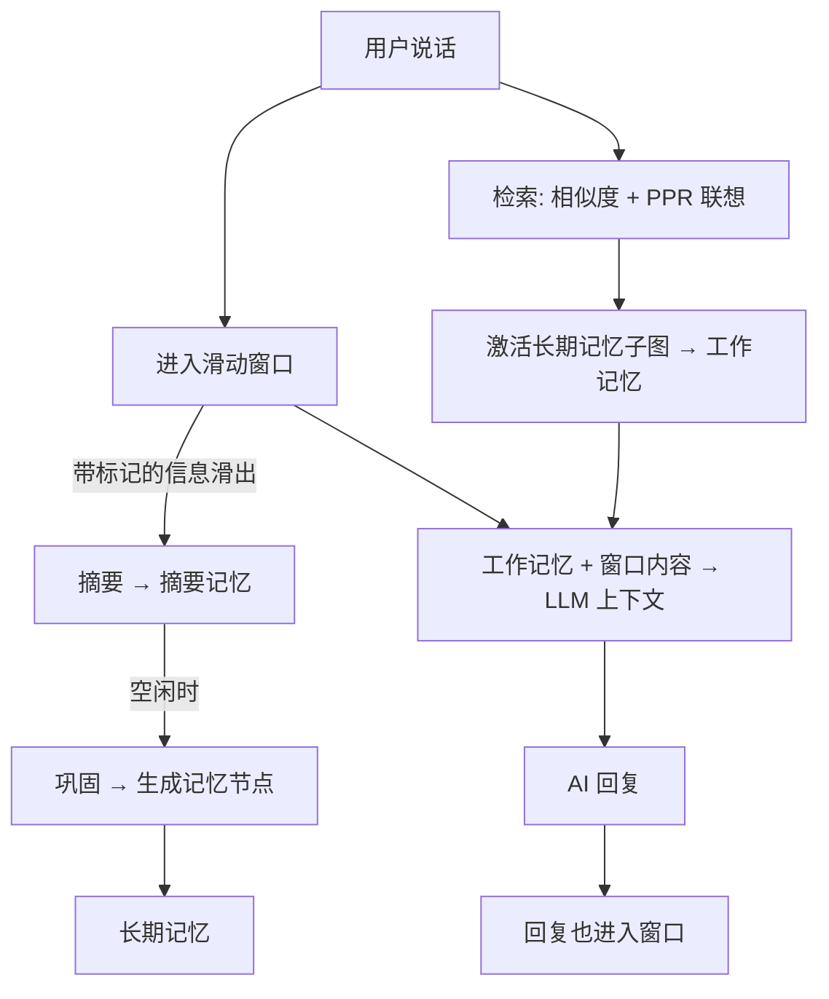

# 核心概念 · 长期记忆、工作记忆与滑动窗口

上一章我们认识了记忆图：它承载着角色全部的情境、语义、程序性记忆。但就像上一章提到的，SoulMem 并不只维护一个图，组织记忆的也不只有图这一种形式——在这一章，我们将看到 SoulMem 的三种记忆层级：**长期记忆、工作记忆与滑动窗口**。

## 三个层级

### 长期记忆：角色的整个记忆图

长期记忆是记忆系统的"仓库"：所有沉淀下来的情境、语义、程序性记忆，以**图**的形式存放在这里。它体积大、变化慢，是角色的"人格底座"。

以小红为例。和她相处三个月，你们一起吃的麻辣烫、她喜欢的苦味、她紧张时摸辫子的习惯——这一切最终都会沉淀在长期记忆里。长期记忆不随对话结束而消失。

> 长期记忆以数据库的形式持久化存储于硬盘上。一些记忆算法（例如遗忘）会在长期记忆上运行，相关内容将在后续章节论述。

 

### 工作记忆：被激活的记忆子图

工作记忆是"激活"出来的子图——从长期记忆里，把当前对话可能相关的部分临时取出来使用。

打个比方：长期记忆是你的书房里所有的书；工作记忆是你此刻摊开在桌上、正在读的那几本。

工作记忆有两个特点：

- **它主要来自长期记忆**：检索把相关的节点从长期记忆的图中激活出来，临时组成一个子图；此外，本次对话新产生、尚未巩固回长期记忆的内容也先待在这里；
- **它变化频繁**：对话中新产生的记忆先进入工作记忆，检索命中的子图也会进入工作记忆。

> *注*：严格来说，工作记忆 = 从长期记忆激活出来的子图 + 本次对话新产生、尚未巩固回长期记忆的内容。 
 
    
> 巩固与检索算法将在后续章节阐述。

 

### 滑动窗口：最近几轮对话

实际上，滑动窗口是工作记忆的一部分，但它非常特殊，它是工作记忆的"输入缓冲区"——记录最近几轮用户和角色的对话。它模拟人的短期记忆：容量有限，新的进来，旧的滑出去。

窗口中的每条信息都可能带有一个标记。信息滑出窗口时，根据是否带标记，行为分为两种：

- **被打上标记的**：触发一次摘要——整个滑动窗口内容被 LLM 压缩成一条"摘要记忆"，摘要随对话持续累积，等待被巩固；
- **没被标记的**：随窗口滑出而丢失——就像你不记得昨天午饭具体吃了什么。

> 每次摘要时，之前累积的摘要也会一并参与压缩。

窗口内最近的对话内容，在检索时**无条件**进入上下文。因为"刚刚说过的话"无论如何都该被记得，不需要经过联想。

 

## 为什么需要三个层级？

长期记忆的必要性不言而喻，没有长期记忆，角色的记忆内容在SoulMem进程退出时就会丢失。

但是，既然长期记忆里什么都有，那每次对话直接把整个图丢给模型不就行了？

### 滑动窗口
记忆图虽然完美地表达了记忆之间的网状联系，却丢失了时序信息。在对话场景下，消息历史带有天然的时序属性，这意味着我们需要一种线性的数据结构来存储它。

而模型的上下文窗口是有限的，对话历史不能无限增长，上下文过长还可能降低生成质量。因此，一个容量有限的窗口是相对简单有效的解决策略，滑动窗口就提供了这样一个"当下"的焦点。

同时，人类无法准确地记住每一条消息，琐事会被快速遗忘。如果每轮对话都直接变成永久记忆，长期记忆会迅速被垃圾淹没。因此，摘要会提炼出对话中的重要信息，再通过巩固返回长期记忆。

> 摘要机制本质上也是一种遗忘，后续关于遗忘算法的章节会详细阐述。

 
    
### 工作记忆

对于长期存活的**赛博生命**，整个记忆图会随时间推移变得庞大。记忆图存储于硬盘上，将其全量加载需要大量内存，直接从硬盘读写也会影响性能；而联想机制又需要依赖图的局部结构，例如某个记忆节点的邻居。因此，用户的消息会激活一个记忆子图作为工作记忆。

此外，工作记忆也是一种筛除无关内容的方式。联想是从"当前话题"出发的：你说"晚上吃啥"，系统要想起的是和"吃"有关的记忆，而不是三个月前的一件琐事。如果所有记忆平铺在一起，联想就没有出发点和聚焦的方向。因此，工作记忆也提供了"从焦点联想出去"的空间。

 

### 人本来就是这样运作的

人**不能**同时记住所有事 → 滑动窗口限定了"短期"的容量；人**能**想起很久以前的事 → 长期记忆以图组织，支持联想检索；人**会**把反复出现的经历沉淀成习惯和认知 → 巩固机制。

SoulMem的三层记忆各司其职——**长期记忆负责"沉淀"，工作记忆负责"联想与使用"，滑动窗口负责"最近的对话"。** 分层不是为了复杂，而是为了让记忆的性质能有其对应的结构。

因此，上述问题的答案是：显然不行。图会随着相处时间不断长大，一次对话却只需要其中很小的一部分；而且人的记忆本来就不是这样运作的——你不可能同时"想起"所有事，你只会想起与当下有关的那些。

 

---

## 一次对话的完整旅程

让我们把三个概念串起来，看看一次完整对话里发生了什么：

1. 用户说话 → 进入**滑动窗口**；
2. 带标记的信息滑出 → 触发**摘要**，窗口内容被 LLM 压缩成摘要记忆（随对话累积）；
3. 空闲时，摘要记忆被**巩固**成记忆节点，与高频激活的节点建立连接，写入**长期记忆**；
4. 用户说话 → 系统在**长期记忆**上检索（相似度找到种子，PPR 联想扩散），激活相关子图成为**工作记忆**；
5. 窗口内容（短期）+ 工作记忆（联想结果）→ 组成 LLM 的上下文；
6. AI 回复 → 也进入窗口，开始下一轮循环。

 
    
这三层的配合，是 SoulMem 整个系统运转的骨架。后面的章节会逐一展开每一层的实现细节。
