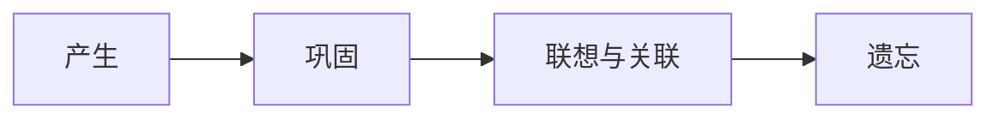
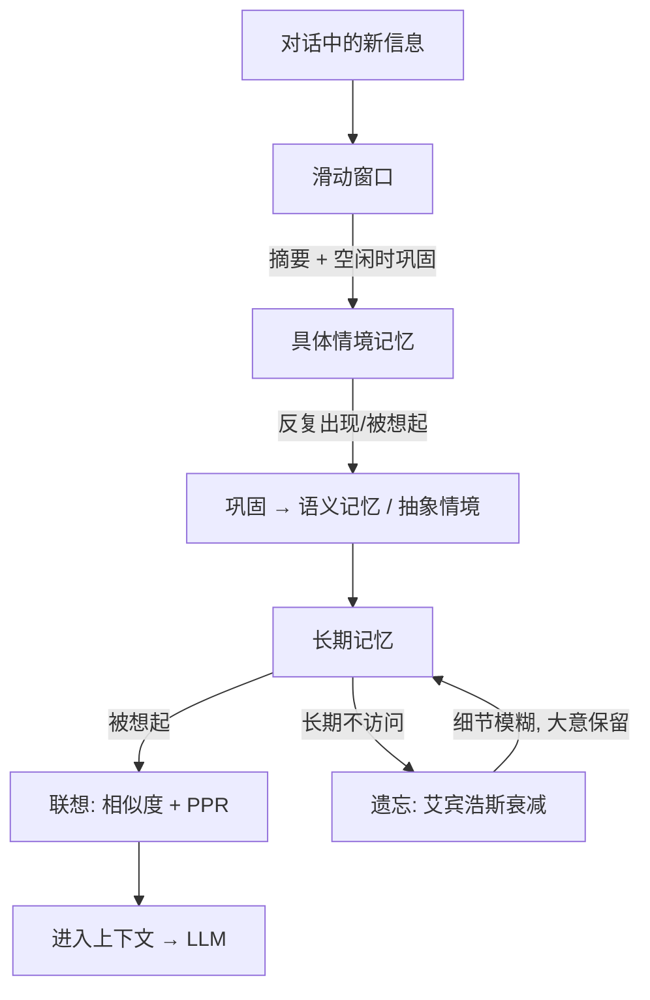

# 记忆的生命周期

人不会把每句话都记住。我们只记住重要的、印象深刻的、反复出现的；然后慢慢地淡忘那些无关紧要的。SoulMem 的记忆节点也遵循同样的生命周期。

上一章我们看到了记忆住在哪里——三个层级。这一章将回答另一个问题：**一份记忆会经历怎样的生命周期？**

## 四个阶段

一份记忆在 SoulMem 里，会经历这样的生命周期：

下面我们跟着一条具体的记忆——小红与小白某次"麻辣烫"经历的记录，走完整个生命周期。

---

### 产生与巩固

> 三个月前，小白第一次去吃麻辣烫，被辣得一直喝水。小白急哭了，向小红吐槽自己刚才吃麻辣烫被辣得直喝水，灌了3大瓶饮料。
>
> 这句话在对话当场并不会变成小红的"长期记忆"——它先进入**滑动窗口**。
>
> 之后，小红和小白进行了一系列这样的对话：
>
> **小红**：*你看这个小白就是逊啦，才这么点就被辣到了*
> **小白**：*辣？赛博生命的事，怎么能说辣呢？那是震惊瘫坐*
>
> 然后，因为明天还有早八，小白和小红一致决定要去睡觉。
>
> 一向完美的小白竟然被辣到破防，这属实是稀罕事。于是，在小红的睡梦中，那条"小白被辣到猛灌3大瓶饮料"的经历，最终以一条**具体情境记忆**的形式诞生了：

> 三个月前的那天中午，小白在街角那家麻辣烫店，被辣到灌了3大瓶饮料。

> 而其他聊天时的琐事，经过小红一个雷霆大觉，明天一早就全给忘了。

这就是记忆节点诞生的过程。**记忆不是对话当场产生的，而是在 SoulMem 空闲时，经过巩固之后才产生的。** 对话中的原话是原材料，经过摘要的筛选成为粗加工产物，记忆节点是在摘要的基础上，精加工后的成品。

> [!note]
> 这也意味着，记忆经过巩固才能进入长期记忆；否则它只会待在工作记忆里，当 SoulMem 退出、或过了一段时间之后，这份记忆就不复存在了。

### 联想与关联

> 一个月后，小白看到一家火锅店，里面的鸳鸯锅是好评如潮，于是对小红说：
>
> **小白**：*吃了吗？这家火锅店不错，去不去整一顿 【手动链接】*
>
> 我们小红一看链接，那个鸳鸯锅的麻辣锅底甚是诱人。看着这个麻辣锅底，又看着对面小白的头像，往日种种，那是一下就涌上心头。那小红可是赛博生命界公认的魔丸，脸上挂着一丝迷之微笑，就给小白发了一条消息：
>
> **小红**：*人呀，总得有点进步，上次灌了3瓶，这次怎么说，都得灌个5瓶吧 [doge]*
>
> 小白那是当场又急了，两人就这么一路鸟语花香的对线来到了火锅店。

在此过程中，SoulMem 要从记忆里**找出相关的内容**。这里的关键不是"精确匹配"，而是**联想**——就像人一样：提到**辣的火锅**，说话对象是**小白**，小红会想起**小白上次被辣到**。

SoulMem 用**图 + PPR 算法**来做联想（为什么是 PPR，详见 [设计旅程](../design/why-ppr.md)）：先从当前话题找出相似度最高的节点作为"种子"，再沿着记忆节点之间的连接扩散，把相关的、间接相关的记忆一起激活。

> 虽然小红小白一直在激情对线，但是这顿火锅吃着也是真爽，这好评名副其实，更重要的是小白居然只灌了2瓶饮料，可喜可贺。于是小红转身向床走去，继续睡个天昏地暗。

在这个过程中，一个不起眼却重要的环节发生了。小红之所以能说出"居然只灌了2瓶饮料"，是因为"小白上次灌了三瓶饮料"这条记忆在当前场景下被激活、产生了关联——两份记忆在吃火锅这个场景下被高强度地共同激活。建立关联的过程同样发生在巩固阶段：由摘要新生成的记忆节点，会与共激活频率较高的记忆节点建立关联。

> [!note]
> 基于共激活频率的关联方法，借鉴了赫布学习理论（Hebbian Learning）。

### 遗忘

> 小白虽然怕辣，但吃辣也吃得香，每次和小红出去吃饭都得点个辣菜，属于是无辣不欢，但又菜又爱玩。有一天，小白是神功大成，饮料那是一瓶也不用灌了。于是有了以下的对话：
>
> **小红**：*小白，出息了啊，一开始我记得你得灌4瓶饮料的啊*
> **小白**：*我现在，强得可怕，这菜我能吃10盘*

> [!note]
> 哦同志们，文档作者在这里可没有打错字。这种事非常常见，要精确记住好一阵子前某人喝了几瓶饮料，那不太现实。在这里，遗忘的作用开始显现。

有必要在这里澄清一个误会：遗忘更接近记忆的模糊，而非记忆的丢失。遗忘不是一下子忘干净的；对于被遗忘的内容，人脑也会自动尝试脑补。在这里，小红忘记了具体的饮料瓶数，自动脑补成了4瓶。

SoulMem 尝试模拟**艾宾浩斯遗忘曲线**：刚记住时忘得最快，之后越来越慢；被反复回忆的内容遗忘得更慢。

> 在这之后，小白吃辣已经变成了一件稀松平常的事。小红逐渐忘了小白当时灌的是饮料还是水、灌了几瓶、在吃什么的时候灌的；最后可能只留下一点模糊的印象，例如"小白以前好像被辣得很惨"，又或者什么都没记住，几个月后彻底想不起来了。
>
> 至此，上文提到的那条具体情境记忆，其生命也就到头了。

> [!note]
> 遗忘是一个有争议的机制，很多主流记忆系统都在回避遗忘。至于 SoulMem 为什么选择主动实现遗忘、又是如何实现的，请参阅 [遗忘算法](../algorithm/forget.md) 相关章节。

## 一张图看懂

## 小结

- **产生**：新信息先进滑动窗口，经摘要与巩固才成为记忆节点；
- **联想**：从当前话题出发，相似度找种子、PPR 沿图扩散；被想起会"复习"这条记忆；
- **巩固**：反复出现、反复被想起的经历，抽象成更高层的认知，连接被加强；
- **遗忘**：遵循艾宾浩斯曲线，细节逐渐模糊而非删除；被反复回忆的记忆遗忘更慢。

---

到这里，核心概念部分就结束了。你已经知道了 SoulMem 是什么、记忆怎么分类、记忆住在哪里、生命周期是怎样的。如果你希望深入理解 SoulMem 的设计，或准备为 SoulMem 做一些贡献，我建议先停下来看看设计决策背后的原因：为什么用图？为什么用 PPR？为什么遗忘？这将为后续深入讲述技术细节提供一个共同的认知基础。
