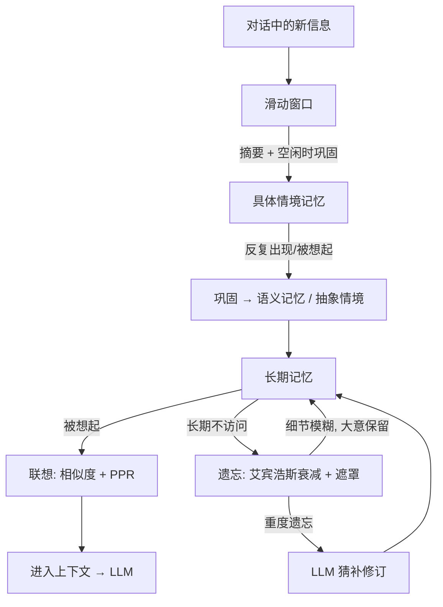

# 核心概念 · 记忆的生命周期

人不会把每句话都记住。我们只记住重要的、有情绪的、反复出现的；然后慢慢地淡忘那些无关紧要的。SoulMem 也遵循同样的节奏。

上一章我们看到了记忆住在哪里——三个层级。这一章回答另一个问题：**一份记忆，会如何度过它的一生。**

## 四个阶段

一份记忆在 SoulMem 里，会经历这样的一生：

```text
产生 → 联想（被想起） → 巩固（沉淀） → 遗忘（淡去）
```

下面我们跟着一条具体的记忆——小红和用户的"麻辣烫"经历——走完它的一生。

### ① 产生：记住

三个月前，小红第一次和用户去吃麻辣烫，被辣得一直喝水。

这句话在对话当场并不会变成"长期记忆"——它先进入**滑动窗口**。窗口容量有限，新信息滑进来、旧信息滑出去；当带标记的信息滑出时，窗口内容被摘要压缩，等到系统空闲时再被巩固成记忆节点。

于是，那条"被辣到"的经历，最终以一条**具体情境记忆**的形式诞生了：

> 2026-07-12 中午，和用户在街角那家麻辣烫店，被辣到了。

注意"诞生"的时点：**记忆不是对话当场产生的，而是巩固之后才产生的。** 对话中的原话是原材料，记忆节点是加工后的成品。

### ② 联想：被想起

一个月后，用户说："晚上吃啥？要不吃点辣的？"

系统要从记忆里**找出相关的内容**。这里的关键不是"精确匹配"，而是**联想**——就像人一样：你提到"吃辣"，小红会想起"上次被辣到"。

SoulMem 用**图 + PPR 算法**来做联想（为什么是 PPR，详见[设计旅程](../design/why-ppr.md)）：先从当前话题找出相似度最高的节点作为"种子"，再沿着记忆节点之间的连接扩散，把相关的、间接相关的记忆一起"点亮"。

于是"吃辣"这个话题，联想到了那条麻辣烫记忆——小红想起自己被辣到的狼狈，说："可以呀，但我要点微辣！"

被想起不是免费的：每一次被想起，这条记忆的**被提取次数**都会增加。这很重要——你会在遗忘阶段看到它的作用。

### ③ 巩固：沉淀

后来你们又一起吃了好几次辣——每次都被辣到。

系统注意到这条经历**反复出现、反复被想起**，于是巩固发生了：把多次类似的具体经历抽象成更上层的认知。

> 用户喜欢吃辣（但我得点微辣）。

具体的经历沉淀成长期的知识——这正是三类记忆协作的方式：**情境记忆**在反复中抽象成**语义记忆**；特定情境反复触发特定行为，则长成**程序性记忆**（习惯）。

巩固还做另一件事：把"经常一起被想起"的记忆连接得更紧——就像人脑的 LTP 机制，共同激活让连接变强，也让以后的联想更容易到达它们。

巩固发生在系统空闲时：滑动窗口的摘要被拆解成记忆节点，与高频激活的节点建立连接，写入长期记忆。至此，这条记忆才算真正"住进"了长期记忆。

### ④ 遗忘：淡去

又过了半年，你们很久没去那家店了。

遗忘开始了。SoulMem 模拟**艾宾浩斯遗忘曲线**：刚记住时忘得最快，之后越来越慢；被反复回忆的内容遗忘得更慢。具体到这条记忆：

- 店名、日期、点了什么——细节开始模糊，被遮罩掉（替换成 `[masked]`）；
- 但大意还在——"和用户吃过麻辣烫，被辣到"；
- 如果它被想起的次数够多，遗忘就会减缓——**复习让记忆更牢固**；
- 如果长期不被想起，连大意也开始模糊。此时系统会调用 LLM 尝试**猜补**——像人一样"努力回忆"。

> 为什么"模糊"而不是"删除"？删除是永久的，模糊则保留了大意。这更接近人类：你可能记不清那顿饭的具体菜名，但还记得"和谁、大概什么感觉"。详情见[设计旅程 · 为什么遗忘用遮罩](../design/why-forgetting.md)。

> *注*：并不是所有记忆都会被遗忘。**程序性记忆（行为习惯）和抽象情境**不会淡去——习惯一旦形成就稳定存在，抽象情境作为索引也保持稳定。会被遗忘的，是具体的经历和具体的事实。这符合直觉：人会忘掉某一次具体的事，但不会忘掉自己是个什么样的人。

## 一张图看懂



## 小结

- **产生**：新信息先进滑动窗口，经摘要与巩固才成为记忆节点；
- **联想**：从当前话题出发，相似度找种子、PPR 沿图扩散；被想起会"复习"这条记忆；
- **巩固**：反复出现、反复被想起的经历，抽象成更高层的认知，连接被加强；
- **遗忘**：遵循艾宾浩斯曲线，细节逐渐模糊（遮罩）而非删除；被反复回忆的记忆遗忘更慢。

---

到这里，核心概念部分就结束了。你已经知道了 SoulMem 是什么、记忆怎么分类、住在哪里、如何度过一生。下一部分我们开始讲"为什么"——为什么用图？为什么用 PPR？为什么遗忘用遮罩？这些决策背后的故事，才是 SoulMem 的灵魂。

*下一步：[设计旅程 · 一切的起点](../design/origin.md)*
