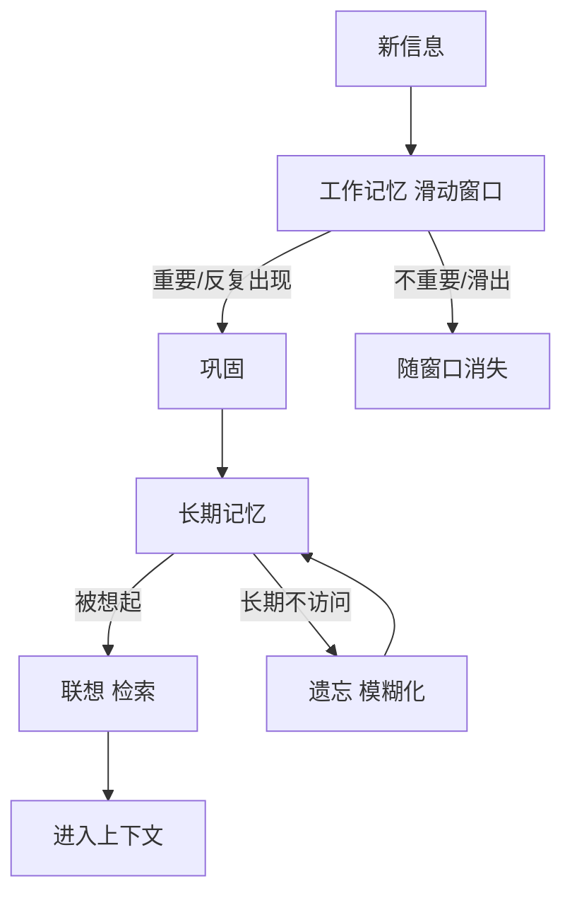

# 核心概念 · 记忆的生命周期

> 人不会把每句话都记住。我们只记住重要的、有情绪的、反复出现的；然后慢慢地淡忘那些
> 无关紧要的。SoulMem 也遵循同样的节奏。这一章讲记忆的四个阶段。

## 四个阶段

一份记忆在 SoulMem 里，会经历这样的一生：

```text
产生 → 联想（被想起） → 巩固（沉淀） → 遗忘（淡去）
```

### ① 产生：记住

对话中，新信息进入系统。它不会立刻成为"长期记忆"——而是先进入**工作记忆**。

工作记忆是什么？可以把它理解成"现在脑子里正在想的事情"。人没法同时记住所有事，所以
工作记忆的容量是有限的。SoulMem 用一个**滑动窗口**来模拟这一点：只保留最近几轮对话，
更早的内容要么被加工后沉淀下来，要么就随窗口滑出而消失。

### ② 联想：被想起

当用户提问时，系统要从记忆里**找出相关的内容**。

这里的关键不是"精确匹配"，而是**联想**——就像人一样：你提到"昨天那家店"，我会想起
"对，你被辣到了"；你提到"最近有点烦"，我可能想起"你上次说压力大的时候会去跑步"。

SoulMem 用**图 + PPR 算法**来做联想（详细见设计旅程部分）。简单说：从当前话题出发，
沿着记忆节点之间的连接扩散，找出"相关的"和"间接相关的"记忆。

### ③ 巩固：沉淀

短期记忆不会自动变成长期记忆。只有**反复被想起**、或者**足够重要**的记忆，才会被加工
和沉淀下来——把细节提炼成更高层的认知。

比如："上周三吃麻辣烫被辣到" 是一次性事件；但如果经常一起吃辣，就会巩固出一条语义
记忆："用户喜欢吃辣"。

### ④ 遗忘：淡去

这是 SoulMem 与其他记忆系统最不一样的地方：**遗忘是设计出来的一等公民**，不是缺陷。

人遗忘是有规律的（艾宾浩斯遗忘曲线）：刚记住时忘得最快，之后越来越慢；被反复回忆的
内容遗忘得更慢。SoulMem 模拟这条曲线——长期不被想起的记忆，会逐渐"模糊"，被遮罩掉
细节，而不是被直接删除。

> 为什么"模糊"而不是"删除"？删除是永久的，模糊则保留了大意。这更接近人类：你可能
> 记不清那顿饭的具体菜名，但还记得"和谁、大概什么感觉"。详情见 [设计旅程 · 为什么遗忘用遮罩](../design/why-forgetting.md)。

## 一张图看懂



## 小结

- **工作记忆**：手头正在想的，容量有限（滑动窗口）。
- **长期记忆**：沉淀下来的，以图的形式组织（三类记忆节点互相连接）。
- **联想**：从当前话题出发，沿图扩散，找出相关记忆。
- **巩固**：把值得记住的短期记忆提炼成长期记忆。
- **遗忘**：长期不被使用的记忆逐渐模糊，而不是被删除。

*下一步：[长期记忆、工作记忆与滑动窗口](memory-layers.md)*
