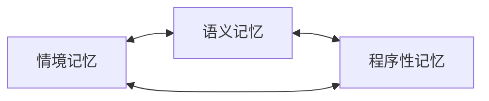

# 核心概念 · 三类记忆

> 这一章没有任何代码。我们只讲一件事：**记忆是什么**，以及为什么把它分成三类。

## 先看一个例子

想象一个叫"格蕾修"的数字角色，和你相处了三个月。这段时间里，她记住了很多事：

- 上周三你们一起去吃了麻辣烫，她被辣得直喝水（*一件事*）；
- 她喜欢苦的东西，讨厌甜腻的奶茶（*一个事实*）；
- 她每次紧张的时候，会下意识地摸自己的辫子（*一个习惯*）。

这三样东西，本质上完全不同。但很多记忆系统把它们塞进同一个筐里，不加区分。

## 三类记忆

SoulMem 参考人类记忆的分类，把记忆分成**三类**，让每一类各司其职：

### 情境记忆（Episodic）——"我经历过什么"

记录**具体的事件**：时间、地点、人物、发生了什么。

> "2026-07-12 中午，和用户在街角那家麻辣烫店，被辣到了。"

情境记忆是"个人历史"。它是时间的切片，有明确的时间戳。

### 语义记忆（Semantic）——"我知道什么"

记录**通用的概念、事实和关系**，剥离了时间和地点。

> "用户喜欢苦味，讨厌甜味。"（不是"上周三那次"——而是一条长期有效的知识）

语义记忆像一本知识手册，也是三类记忆的"中枢"：概念之间互相连接，形成一张知识网。

### 程序性记忆（Procedural）——"我会怎么做"

记录**行为习惯、条件反射、说话方式**——不是"知道"什么，而是"会"什么。

> "紧张的时候摸辫子。" / "被关心的时候，嘴上却否认（傲娇）。"

程序性记忆不会告诉你"发生了什么"，它告诉你**在什么情境下，这个角色会怎么行动**。

## 为什么分开很重要

如果把三类记忆混在一起，会出现什么问题？

**情境和语义混淆**：如果"用户喜欢苦味"和"上周三吃麻辣烫"被当成同一种东西，那么当三个月后用户随口说"来杯咖啡"时，系统可能把那次麻辣烫事件（以及被辣到的狼狈）都翻出来——因为它们在同一个容器里。

**行为和知识混淆**：一个角色"知道"关心别人和"习惯性"地否认关心，是两回事。前者是知识，后者是行为模式。如果混在一起，行为模式就难以被单独触发和演化。

分开之后，每一类记忆都有**自己的结构、自己的算法、自己的生命周期**。这也是 SoulMem 的核心设计之一：**"一切特征和事件都属于记忆"**——性格、口癖、行为习惯，都不是写在静态角色卡上的，而是记忆系统长出来的结果。

## 记忆怎么存在一起

这三类记忆不是三个孤立的盒子，而是**一张图**上的三种节点。节点之间可以互相连接：

为什么用"图"而不是"列表"？这是下一章的话题——但你可以先感受一下：记忆最迷人的地方是**联想**，而联想天然是图上的事情。

---

*下一步：[记忆的生命周期](memory-lifecycle.md) —— 记住、联想、巩固、遗忘*
