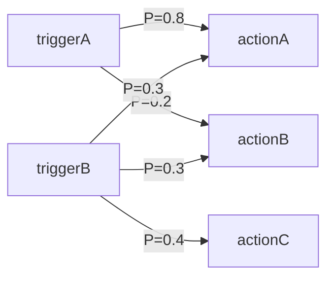
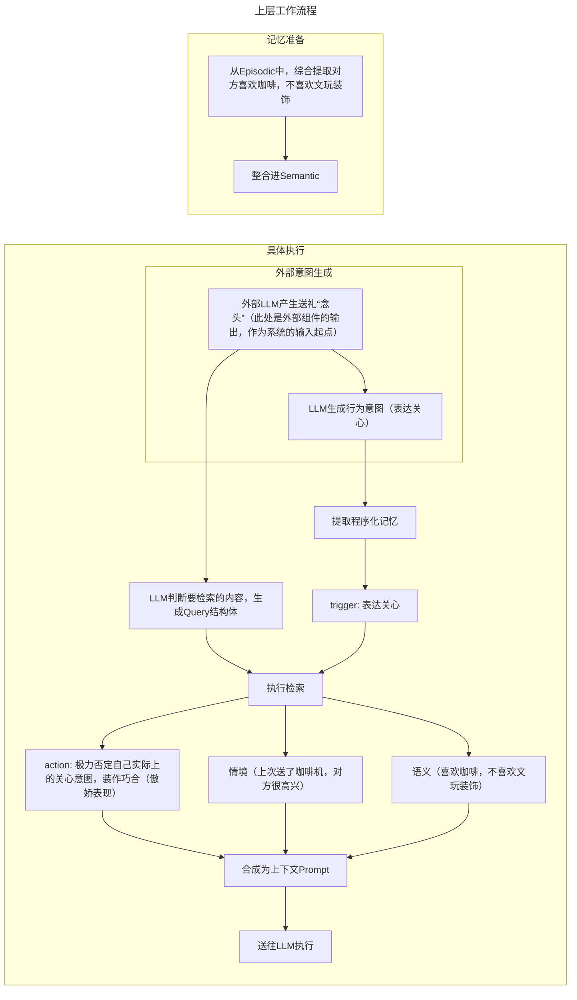
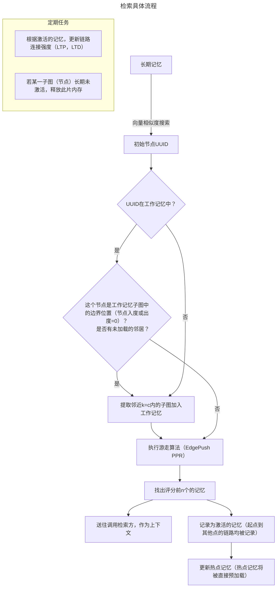
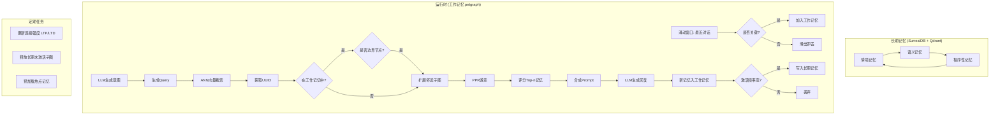
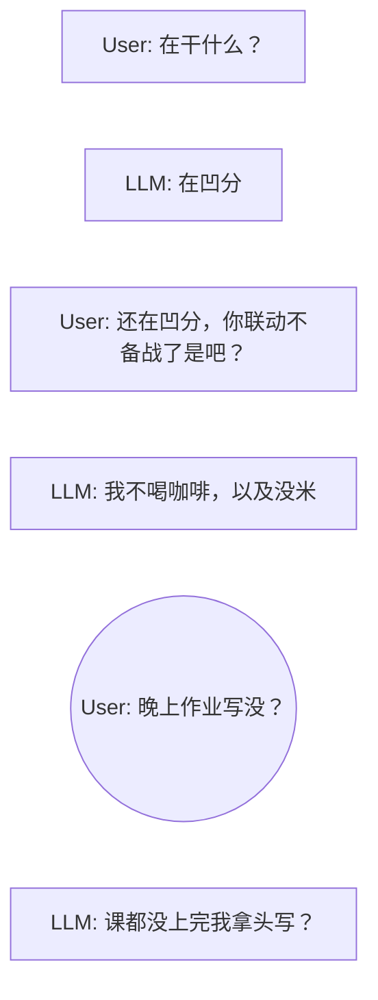
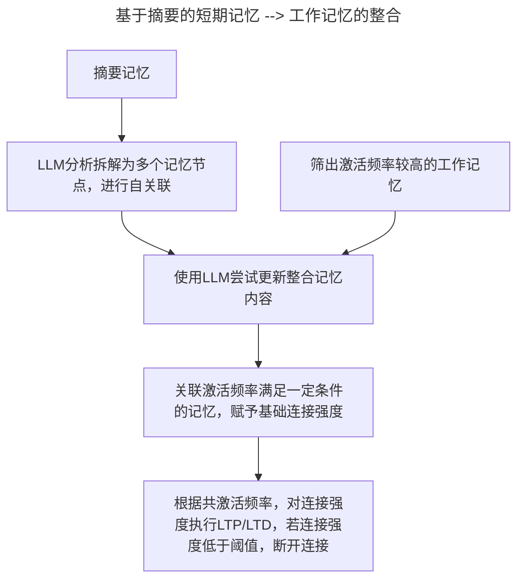

# SoulMem Beta ver.

SoulMem是一个专为角色扮演任务设计的记忆系统，它**旨在**使LLM的输出更拟人化成为可能，让模拟角色像人一样记住重要的、情感相关的、可驱动行为的事，**它不旨在**精确地记忆细节，知识。

SoulMem是针对于**个人用户**，在**家用电脑**上运行的记忆系统，并非企业级解决方案。

SoulMem的alpha版本中，采用统一的MemoryNote作为记忆节点，导致后续实现概念性，程序性记忆时，非常困难，故调整架构。

## 总体说明

SoulMem本质是一个复杂的RAG系统，它结合了向量搜索和知识图谱，以图的方式组织记忆数据。SoulMem被设计具有以下能力：

- 记忆的整合与进化
- 记忆的遗忘
- 基于工作记忆子图的记忆联想（Personalized PageRank）
- 记忆的动态添加

SoulMem使用rust开发，使用async-openai进行LLM API调用，使用**SurrealDB**作为**向量**，图，**时间序列**数据库。

**注**：SurrealDB是一个多模态数据库，没有提供一些有用的算法，但对于我们当前的场合应当够用，只使用一个数据库，我们换来的是开发时不需要维护数据一致性的巨大便捷，以及家用电脑上不需要同时加载多个数据库的大量内存开销。

## 整体组织

记忆整体上仍以图的方式组织。

总记忆图可以分为三类子图

- 情境记忆子图（Episodic）
- 语义记忆子图（Semantic）
- 程序性记忆子图（Procedural）

### 情境记忆子图（Episodic）

情境记忆主要用于记忆具体的事件经历，例如“在昨天的中午12:00和同学出去吃了顿麻辣烫，自己被辣喷了”这类型的描述就属于情境记忆。

情境记忆节点分为两类：

- 具体情境节点
- 抽象情境节点

#### 具体情境节点

情境记忆节点具有以下属性：

- narrative
  - 情境的自然语言描述
- time_span
  - 情境的起止时间
- context
  - 情境发生的上下文

对于context，有以下属性：

- Option<Location> 
  - 情境发生的位置
- Vec<participant>
  - 情境发生时，参与的对象
    - 对象可以是自己，他人，物体或其他（就是暂时不知道怎么分类的东西）
- Vec<emotion>
  - 情境发生时，自己当时的情感
    - 情感具有标签分类和强度两个属性
- Vec<SensoryData>
  - 情境发生时的感官描述
- situation
  - 情境发生时，具体上下文（背景）的自然语言描述

具体情境记忆在SurrealDB中，还建立时间序列，这意味着允许通过时间段来回忆对应时间段的情境记忆

#### 抽象情境节点

抽象情境节点总括一类具体的情境，例如“在雨天散步”，“生日聚会”就属于抽象情境，这些情境的描述都可以被具象化，例如“在昨天和同学在操场雨中乐走”。

抽象情境节点与它的所有对应具象节点建立联系，充当**二级索引**，以及子图间联系的重要**接口节点**。然而，具象情境节点也可能直接与外部建立联系。

### 语义记忆子图（Semantic）

语义记忆子图主要用于记忆通用的概念和事实，关系等，例如“北京是中国的首都”，“原神是mihoyo旗下的一款游戏”，“张三是李四的好友”，“王五是某角色激推”都属于此类型的记忆。

语义记忆以传统知识图谱的方式组织，是总记忆图的中枢核心，承担类似海马体索引的功能。语义记忆节点本身就是接口节点。

语义记忆节点具有如下属性：

- content
  - 具体的概念，事实内容，通常为词汇或词组
- Vec<alias>
  - 别名，用于去重，消歧，保证图谱的精简
- concept_type
  - 概念类型，Entity（具象的人，物品，如“张三”，“原神”），或Abstract（抽象概念，如“自由”，“意义”，“生命”等）
- description
  - 一些更具体的限定描述，以自然语言组织

语义记忆的边具有如下属性

- verb
  - 谓词，表明节点间的具体关系
- intensity
  - 连接强度
- confidence
  - 连接置信度

### 程序性记忆子图（Procedural）

- [ ] **（以下待商讨确定）**

程序性记忆主要存储“肌肉记忆”，“条件反射”， “行为习惯”这一类的执行相关的记忆，例如“沉思时会摸下巴”，“听到铃声就害怕的蜷起来”， “明明很关心对方嘴上却强调不在乎（傲娇）”都属于程序性记忆。

程序性记忆中有节点类型的区分，主要分为：

- trigger
  - 情境触发器，可以由一种抽象情境或具象情境组成，一般由情境记忆提供。
  - trigger节点在PPR的结果中是不可**最终抵达**的，只能作为途径的路径
  
- action
  - 具体的，可以用作LLM的Prompt的，指导性的行为自然语言描述
  - 它通常并非是具体动作，如‘抬起右手”，而是描述一类行为倾向，例如“否定自己的关心意图”，“对他人成果进行贬低”，以获得更好的具体情境上下文的适应性，除非这个特定动作是角色的标志性特征，例如“每句话末尾加death”

### 子图间的联系

除了三大子图内互相的联系外，子图间也具有以语义记忆子图为中枢的子图间联系。

#### 语义记忆 <--> 情境记忆

语义记忆中的节点可以连接到多个**抽象**或**具象**的情境记忆，比如语义节点中“项目”这一概念，可能会联系到情境记忆中“赶项目”的抽象情境记忆，进而联系到“与伙伴熬夜赶项目差点晕过去”的具体记忆。直接联系到**具象情境记忆**表面这个具体情境影响力很大。

这种联系支持了从概念抽取一类情境的能力，可以解决一部分的多跳问题，同时也保留了让某些具体情境“更突出”的能力。

**注**：由于具象情境记忆通常由抽象情境记忆索引，因此如果具象情境记忆直接与外部相连，相当于缩短了图中的路径距离，由于PPR具有局部特性，具象情境记忆会更容易被检索到，以及更容易从这个具象情境检索到其他相关内容。此时如果再赋予较高的边权，它的影响会进一步放大。

#### 情境记忆 <--> 程序性记忆

情境记忆，不论是抽象情境还是具体情境节点，都可以作为程序性记忆的trigger，**抽象情境**更多描述的是一种“**条件反射**”，比如“听到铃声” --> “润出教室”，**具体情境**更多是一种**极其强烈的影响**，例如“完成某个研究并成功发了顶刊” --> “骄傲自豪的介绍成果”，或者是某些**创伤性记忆**，例如“某次具体的被虐待经历” --> “感到极度恐惧，话语颤抖”。

#### 语义记忆 <--> 程序性记忆

语义记忆中的节点可以直接连接至action，但是，经由语义记忆路径联想到的action不会被触发，而是作为一种**概念性补充**和**自我认知**，例如语义记忆节点“张三”联系到动作“无视”。以下说明区别：

- 如果由**抽象情境记忆**“遇到张三”联想到动作“无视”，那么无视的行为被触发，会进入指导LLM动作的提示词
- 如果由**语义记忆**“张三”联想到动作“无视”，那么无视的行为不会被触发，作为补充上下文加入LLM提示词，让角色获得“遇到张三时我通常会直接无视”的自我认知

- [ ] **（此部分有待讨论）**

### 长期记忆与工作记忆

长期记忆与工作记忆均是由三大子图（情境记忆，语义记忆，程序性记忆）组成的，工作记忆一定是长期记忆的子图。

#### 长期记忆

长期记忆存放在数据库中，是持久化的记忆，每隔一段时间，长期记忆内部会进行整合，优化，同时执行遗忘，模糊等操作

#### 工作记忆

工作记忆是在记忆系统运行过程中，从长期记忆中激活的子图。任何除了长期记忆中上文提到的算法，都是在工作记忆中运行的。工作记忆使用petgraph作为图存储。工作记忆中记忆的修改是较为频繁的，在对话中生成的新记忆也首先加入工作记忆，工作记忆中激活频率达到一定次数的记忆将被巩固为长期记忆，否则会被丢弃。

工作记忆中还存在一个**滑动窗口**，由于记录最近几轮用户与LLM的对话，处于滑动窗口中的记忆可视为“**短期记忆**”，如果在滑出前没有被加入工作记忆，这些记忆就会丢失。滑动窗口中的记忆**无条件**的加入最终一次记忆提取生成的上下文。

## 运行流程

### 概述

我们以LLM扮演的傲娇角色给好朋友（用户）送礼为例：

在具体的执行检索和提取记忆的环节，有如下流程：

这样的结构控制了上下文的数量，防止上下文爆炸。

可以为SoulMem预设置一些核心记忆，这些记忆将作为特殊的热点记忆，每次都会被加入到上下文中，确保角色的一致性。

综合如下

### 存在的问题

- [ ] 如何正确构造Prompt让LLM能准确生成行为意图和Query结构？

- [ ] **重要**：由于我们分块加载子图，如果节点处于临近边界的位置（例如再移动至下一个节点就到达图的边界），可能会丢失一部分的子图信息（未被加载入工作记忆）

  ​	可能解决方案：

  - 强制每次检索到的UUID加载其附近子图
  - 设置软标记标记这个节点缺失了邻居
  - 智能懒加载，在PPR结果出现异常时加载

- [ ] 记忆满足什么条件才能被加入工作记忆？

- [ ] 记忆的整合应该如何执行？

### 记忆的整合与巩固

记忆的整合指的是将多个类似描述合并为同一个记忆节点，以及建立记忆之间的联系的过程。
巩固指由短期记忆（滑动窗口）转化为工作记忆，或从工作记忆转化为长期记忆的过程。

记忆的整合与巩固是SoulMem系统动态演化的基础，具有与检索同等重要的地位。

#### 短期 -->工作

- [ ] 待定任务，尝试减少或限制LLM的调用次数，防止过高的延迟和api费用。

短期记忆由滑动窗口实现，我们暂时假定这个滑动窗口有3轮对话,对话顺序按消息从上到下

在滑动窗口中，我们每隔一定的消息数，为某个消息打上**标记**，称为**摘要标记**（图中圆形消息），摘要标记的间隔满足以下要求：

- 摘要标记的间隔不大于滑动窗口大小
  - 用于保证每条消息都能被摘要

每当带有摘要标记的消息将要滑出窗口时，对滑动窗口内的信息进行一次**精简摘要**。摘要是累加性的，即此次摘要会在上一次的摘要的基础上继续摘要，这一特殊的临时摘要称为 “**摘要记忆**”。

- 这种累加性的摘要让细节性内容随着轮次提升被逐渐遗忘，同时又能保证对话的一致连续性，文档的编写者认为比较符合人类的认知规律

每当隔一段时间，或者一次对话完成，或者外部模块明确指明了需要**工作记忆整合**的意图，执行工作记忆整合，工作记忆整合指工作记忆范围内的记忆更新。文字流程描述如下：

- 将摘要记忆与激活频率较高的记忆筛出
- 使用LLM深入分析摘要记忆，拆解其中概念，经历，关系等，分为多个记忆节点，并进行这些节点内部的关联
- （待定可选）基于这些筛出的记忆，使用LLM尝试更新这些记忆的内容
- 将激活频率满足一定条件的记忆关联，并赋予基础连接强度
- 对于已经有的连接，执行LTP或LTD

流程图如下：

#### 工作 --> 长期

- [ ] 待定

  大概率，由于项目具体的工期和版本迭代，我们可以暂时不考虑这块，或者只做遗忘衰减，放到后续实现。
  
  
  
  2025.10.3注：
  
  目前暂时确定为，把有过更新的工作记忆直接写入数据库，别的什么都不干，后续再说

## 关键算法

### 图检索——EdgePush PPR 变种

[PPR Introduction Paper](https://arxiv.org/pdf/2403.05198)

[EdgePush PPR Paper](https://arxiv.org/pdf/2203.07937)

**(以下设计有待进一步讨论)**

代数公式
$$
SPPR(v) = (1 - \alpha) \rho(v) + \alpha \sum_{u -> v}SPPR(u) \times \frac{w(u,v)}{\sum_{v' \in N_{out}(u)}w(u,v')}
$$
其中
$$
w(u,v)
$$
与边连接强度，边关系语义匹配度，节点标签增强因子有关。

#### 基本介绍

PPR描述了一个这样的随机游走模型，假设我们有一些允许的起始节点，一个人以一定概率选取其中的一个节点开始，随机的在图上游走，每走一步时，它有α概率停止游走，以（1-α）概率继续随机游走。当这个游走过程一直执行下去，最终会得到一个在图上稳定的概率分布，表征停在图上各个节点的概率，它一定程度反映了某个节点相对于源节点的重要性。EdgePush PPR在其中引入了边权的概念，让沿图的边进行游走受权重调控。

这样的机制，文档编写者认为，一定程度模拟了记忆联想的过程。

### 状态机

一共有两个状态，Working和Idle，所有有关记忆巩固的定期任务，只在Idle时允许进行。当有查询请求时，从Idle转换为Working，如果一段时间后没有进一步请求，状态从Working转到Idle

需要说明的是，在Idle状态下执行定期任务时，有可能会需要转为Working，此时我们**不取消**定期任务，利用数据库的并发操作同时进行。（实际上定期任务大部分的时间应当是在调用LLM，而不是对数据库进行写操作，因此就算遇到读写冲突，Surrealdb不并行执行的情况下，依然不会有不可忍受的延迟问题，不过有待确认）

## 开发设计说明

### 重要原则

能**不使用LLM**，就不使用LLM，原因如下：

- LLM回复较慢，单位是秒级的
- 大量调用LLM的api会造成费用的增加，对于个人用户不友好

因此，我们仅在需要复杂整合，复杂信息提取的场合使用LLM，并保证构造足够良好的Prompt，兼顾质量和较少的token数。

### 开发流程

- 确定三类记忆类型的struct结构，完成基础数据结构的编写
- 编写整个流程，对于其中的特定功能，暂时以todo!()或者返回一个假数据代替，例如PPR的部分
- 测试流程是否能正确跑通
- 细化特定功能实现，并测试
- 集成测试最终效果

## 待办事项

- [ ] 确定程序性记忆的最终结构，使其也能良好的被PPR游走发现
- [ ] 确定记忆的整合和巩固机制
- [ ] 确定PPR游走算法公式
- [ ] 编写基础数据架构
